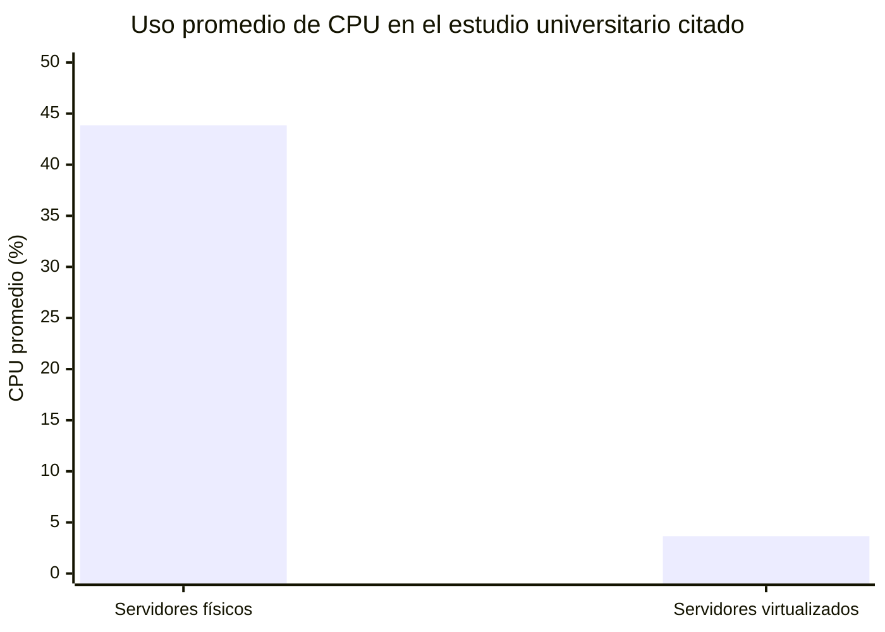

# 02 — Virtualización e infraestructura industrial

## Alcance

Qué es la virtualización, los términos básicos (host, guest, VM, ISO, disco
virtual, hipervisor), sus ventajas y limitaciones, y su justificación para los
TP realizados con VirtualBox.

## Qué es virtualización

**Virtualización** significa que una capa de software presenta a un sistema
invitado recursos computacionales que aparentan ser hardware propio. Los
términos básicos son:

- **Host:** máquina física y sistema anfitrión donde corre VirtualBox.
- **Guest:** sistema operativo que corre dentro de una VM.
- **VM:** entorno virtual que recibe CPU, RAM, disco y dispositivos virtualizados.
- **ISO:** imagen utilizada habitualmente como medio de instalación del sistema operativo.
- **Disco virtual:** archivo o conjunto de archivos que la VM percibe como almacenamiento.
- **Hipervisor:** capa que crea y administra las máquinas virtuales. En el laboratorio, VirtualBox cumple esa función.

La configuración de cada VM determina, entre otros elementos, cuánta memoria
y cuántos procesadores virtuales se presentan al guest, además de dispositivos
y características habilitadas (por ejemplo, el adaptador de red, ver
[`03_Redes_Virtuales_y_Modo_Bridged.md`](03_Redes_Virtuales_y_Modo_Bridged.md)).

## Ventajas de virtualizar

Virtualizar proporciona **aislamiento, portabilidad, consolidación y
facilidad para laboratorios**, porque permite ejecutar más de un sistema
operativo sin dedicar un equipo físico a cada uno. Esa utilidad educativa
también aparece en investigación académica en español: un trabajo de la UNAM
(2022) propuso un laboratorio basado en servidores virtuales precisamente
para permitir prácticas y configuración de servicios en un entorno
controlado.

## Limitaciones y riesgos

Una VM **no elimina restricciones físicas**. CPU, RAM, almacenamiento y red
siguen procediendo finalmente del host. Si se asignan más recursos de los
disponibles o varias VM compiten intensamente por ellos, puede degradarse el
rendimiento. También existe una dependencia de disponibilidad: si el host
falla y no existe alta disponibilidad en otro nivel, las VM de ese host dejan
de prestar servicio.

## Un dato empírico, con su límite de generalización

Un estudio de la Universidad Nacional del Altiplano comparó tres servidores
físicos y tres virtualizados, observando un consumo medio de CPU de **43,85 %
en los físicos frente a 3,66 % en los virtualizados** bajo las cargas
examinadas:

Los autores encontraron una diferencia estadísticamente significativa, pero
su muestra fue de solo seis servidores en un contexto universitario. Por eso
**no debe generalizarse diciendo que "virtualizar siempre reduce la CPU 12
veces"**: es un caso ilustrativo de que la consolidación y la asignación de
recursos pueden mejorar la eficiencia en ciertas cargas, no una ley universal.
En aplicaciones industriales de alta demanda, latencia estricta o fuerte uso
de E/S, el resultado puede ser distinto.

## Por qué tiene sentido en un entorno industrial y de laboratorio

La virtualización permite practicar configuraciones de infraestructura
(instalación de roles, redes, servicios) sin requerir un equipo físico
dedicado por servidor, y sin arriesgar un sistema de producción real. Esto es
exactamente lo que se aprovechó en los TP: sobre una misma PC física
(el host) se crearon dos VM independientes, una con Windows Server y otra con
Ubuntu Server, cada una con sus propios recursos virtuales.

## Preguntas de defensa oral

| Pregunta | Respuesta técnica breve |
|---|---|
| ¿Qué hace VirtualBox? | Virtualiza recursos físicos y los presenta a sistemas guest como CPU, RAM, almacenamiento y dispositivos de red. |
| ¿Qué diferencia hay entre host y guest? | El host ejecuta VirtualBox; el guest es el sistema operativo de la VM. |
| ¿Qué es un hipervisor? | Es la capa que crea y administra entornos virtuales; en el laboratorio esa función la cumple VirtualBox. |
| ¿Virtualizar siempre mejora el rendimiento? | No necesariamente; depende de la carga. El estudio citado es un caso ilustrativo, no una ley general. |

## Fuentes principales

Manual de usuario de Oracle VirtualBox (documentación primaria del
producto); Vicencio Nava y Venegas Guzmán, UNAM (2022), sobre laboratorios
educativos basados en servidores virtuales; estudio de la Universidad
Nacional del Altiplano sobre consumo de CPU en servidores físicos vs.
virtualizados.
