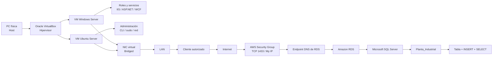

# 11 — Arquitectura integrada, de local a la nube, para la defensa

## Alcance

Síntesis de extremo a extremo de la arquitectura completa del Parcial N.º 1,
utilizando solamente los conceptos ya desarrollados en los diez informes
anteriores: qué componente cumple cada función, qué parte está en local y
qué parte está en la nube, y cómo defenderlo oralmente en cinco minutos.

## Diagrama lógico de extremo a extremo



## Qué está en local y qué está en la nube

| En local | En la nube (AWS) |
|---|---|
| PC física (host) | Infraestructura y hardware de RDS |
| Oracle VirtualBox (hipervisor) | Aprovisionamiento, parcheado y mantenimiento del motor |
| VM Windows Server (IIS/ASP.NET/WCF) | Instancia de base de datos (RDS) |
| VM Ubuntu Server (CLI) | Motor Microsoft SQL Server |
| Red Bridged y LAN | Endpoint DNS, Security Group, VPC |
| — | Base `Planta_Industrial` y su tabla de eventos |

## Qué componente cumple cada función

1. **PC física** utilizada como host — aporta CPU, RAM, disco y red reales.
2. **VirtualBox** como plataforma de virtualización — crea y administra las VM (ver [`02_Virtualizacion_e_Infraestructura_Industrial.md`](02_Virtualizacion_e_Infraestructura_Industrial.md)).
3. **Máquinas virtuales** Windows Server y Ubuntu Server — cada una con sus recursos asignados.
4. **Adaptador de red en modo Bridged** — la VM está presente en la LAN, alcanzable por otros equipos (ver [`03_Redes_Virtuales_y_Modo_Bridged.md`](03_Redes_Virtuales_y_Modo_Bridged.md)).
5. **Windows Server** como ejemplo de servidor de aplicación mediante sus roles y servicios (ver [`04_Windows_Server_Roles_IIS_ASPNET_WCF.md`](04_Windows_Server_Roles_IIS_ASPNET_WCF.md)).
6. **Ubuntu Server** como ejemplo de administración de servidor mediante CLI (ver [`05_Ubuntu_Server_CLI_y_Administracion_Basica.md`](05_Ubuntu_Server_CLI_y_Administracion_Basica.md)).
7. **Paso conceptual** desde infraestructura local hacia Cloud Computing (ver [`06_Cloud_Computing_y_Migracion_Local_a_Nube.md`](06_Cloud_Computing_y_Migracion_Local_a_Nube.md)).
8. **AWS** como proveedor cloud utilizado en la práctica.
9. **Amazon RDS** como servicio administrado de base de datos (ver [`08_AWS_RDS_SQL_Server_y_Endpoint.md`](08_AWS_RDS_SQL_Server_y_Endpoint.md)).
10. **Microsoft SQL Server** como motor seleccionado dentro de RDS.
11. **Security Group** restringiendo TCP 1433 a la IP autorizada (ver [`07_AWS_Security_Groups_Puerto_1433_y_Acceso_Remoto.md`](07_AWS_Security_Groups_Puerto_1433_y_Acceso_Remoto.md)).
12. **Endpoint de RDS** como destino DNS de la conexión remota.
13. **Cliente SQL** (SSMS) que se conecta al servidor.
14. **Creación de `Planta_Industrial`**, tabla industrial, `INSERT` y `SELECT` (ver [`09_Bases_de_Datos_Relacionales_SQL_y_Uso_Industrial.md`](09_Bases_de_Datos_Relacionales_SQL_y_Uso_Industrial.md) y [`10_Transact_SQL_Aplicado_a_Planta_Industrial.md`](10_Transact_SQL_Aplicado_a_Planta_Industrial.md)).

## El modelo por capas

**Capa física:** la PC aporta recursos reales.
**Capa de virtualización:** VirtualBox transforma esos recursos en CPU, RAM, disco y NIC virtuales para cada guest.
**Capa de sistema operativo:** Windows Server y Ubuntu Server administran los recursos virtuales como si fueran propios.
**Capa de servicios:** Windows ofrece IIS/aplicaciones; Ubuntu demuestra administración de servicios y red vía CLI.
**Capa de red local:** Bridged integra las VM a la LAN de manera que pueden funcionar como equipos accesibles por otros clientes.
**Capa cloud:** AWS proporciona recursos de TI como servicio y RDS administra gran parte de la plataforma de base de datos.
**Capa de seguridad de red:** el Security Group determina qué origen/protocolo/puerto puede llegar al recurso.
**Capa de direccionamiento cloud:** el endpoint DNS y el puerto indican al cliente dónde conectarse.
**Capa lógica de datos:** SQL Server procesa T-SQL y almacena la base `Planta_Industrial`.

## Puntos de seguridad críticos

- El Security Group restringido a "Mi IP" (mínimo privilegio), no `0.0.0.0/0`.
- El Security Group y la autenticación SQL son controles **distintos y complementarios**.
- El endpoint es un nombre DNS, no una IP fija que deba asumirse constante.
- "Mi IP" puede cambiar si cambia la IP pública del equipo, y la regla debería actualizarse.
- Bridged expone la VM con un nivel de acceso comparable al del host: conviene firewall propio.

## Recomendaciones prácticas para la defensa oral

Primero, utilizar siempre vocabulario preciso. No decir "VirtualBox da
Internet"; decir que **VirtualBox presenta una NIC virtual y, según el modo
seleccionado, conecta esa NIC con una determinada topología de red**.

Segundo, no afirmar que Bridged "copia la IP del host". La VM normalmente
tiene **su propia configuración IP** dentro de la LAN.

Tercero, no decir que un Security Group "es la contraseña". Es un **control
de tráfico de red**; la autenticación SQL sigue ocurriendo posteriormente.

Cuarto, no identificar el endpoint con una IP fija. Es un **nombre DNS
administrado**.

Quinto, distinguir instancia de RDS, motor y base:

```text
Amazon RDS              = servicio administrado
Instancia de RDS        = recurso de base de datos aprovisionado
Microsoft SQL Server    = motor/SGBD
Planta_Industrial       = base de datos lógica creada dentro del motor
Eventos_Planta          = tabla dentro de esa base
```

Sexto, explicar "migrar a cloud" como **transferencia parcial de
responsabilidades**, no como desaparición de responsabilidades.

## Cómo explicar todo el parcial en 5 minutos

> "Partimos de una PC física que funciona como host. Sobre ella usamos Oracle
> VirtualBox, que es la capa de virtualización, para crear máquinas
> virtuales y asignarles CPU, RAM, almacenamiento y una NIC virtual. En una
> VM instalamos Windows Server y en otra Ubuntu Server.
>
> A las máquinas virtuales les configuramos la red en modo Bridged. Esto
> hace que la NIC virtual se conecte a la misma LAN mediante la interfaz
> física del host, por lo que la VM puede comportarse como otro equipo de la
> red y ser alcanzada desde otras máquinas.
>
> Windows Server demuestra el concepto de servidor de aplicación. Mediante
> Server Manager se instalan roles y características; IIS presta servicios
> web, ASP.NET permite ejecutar aplicaciones web .NET y WCF representa
> servicios de comunicación entre aplicaciones.
>
> Ubuntu Server demuestra que un servidor puede administrarse sin interfaz
> gráfica. Desde la CLI podemos verificar hostname, red, rutas, archivos,
> procesos y servicios.
>
> Luego pasamos del entorno local al modelo Cloud Computing. En vez de
> instalar y mantener nosotros todo el servidor de base de datos, utilizamos
> Amazon RDS, un servicio administrado, y elegimos Microsoft SQL Server como
> motor.
>
> Para acceder remotamente necesitamos el endpoint DNS y el puerto de la
> instancia. SQL Server usa habitualmente TCP 1433. El Security Group
> permite ese puerto solo desde nuestra IP pública, aplicando mínimo
> privilegio; no conviene usar `0.0.0.0/0` porque permitiría conexiones
> desde cualquier IPv4.
>
> Una vez conectado el cliente SQL, ejecutamos T-SQL: `CREATE DATABASE` para
> crear `Planta_Industrial`, `CREATE TABLE` para definir una tabla, `INSERT`
> para cargar datos y `SELECT` para comprobarlos. Cuando aparecen los
> registros confirmamos que la conexión remota y las operaciones principales
> funcionaron.
>
> Así el parcial muestra una arquitectura completa: hardware físico,
> virtualización, sistemas operativos servidor, red local, servicios,
> transición a cloud, seguridad de red y finalmente persistencia de
> información en una base de datos relacional."

## Batería integradora de preguntas de defensa

| Pregunta | Respuesta técnica breve |
|---|---|
| ¿Un servidor es necesariamente una computadora física? | No. "Servidor" puede referirse al equipo, al sistema operativo o al software que presta un servicio. Una VM también puede funcionar como servidor. |
| ¿Qué hace VirtualBox? | Virtualiza recursos físicos y los presenta a sistemas guest como CPU, RAM, almacenamiento y dispositivos de red. |
| ¿Por qué Bridged y no NAT o Host-Only? | Porque el objetivo es que la VM aparezca como otro equipo de la LAN, alcanzable desde otras máquinas; NAT no permite entrada directa y Host-Only no llega a la LAN externa. |
| ¿Qué función cumplen IIS, ASP.NET y WCF? | IIS hospeda aplicaciones/contenido web; ASP.NET ejecuta aplicaciones web .NET sobre IIS; WCF representa comunicación orientada a servicios. |
| ¿Por qué Ubuntu Server puede administrarse sin GUI? | Porque los servicios y la configuración pueden administrarse íntegramente mediante CLI. |
| ¿Qué es Cloud Computing y qué es RDS dentro de ese modelo? | Cloud Computing es provisión bajo demanda de recursos de TI; RDS es un servicio administrado de base de datos relacional dentro de ese modelo. |
| ¿Qué controla el Security Group y qué controla SQL Server? | El Security Group controla qué tráfico de red llega al recurso; SQL Server autentica las credenciales del usuario, ya con el tráfico admitido. |
| ¿Qué pasa si se abre el puerto 1433 a todo Internet (`0.0.0.0/0`)? | Se expone la base a escaneos y ataques desde cualquier origen: fuerza bruta, explotación de vulnerabilidades, ransomware, consumo indebido de recursos. |
| ¿Qué es el endpoint de RDS? | El nombre DNS, asociado a un puerto, que usa el cliente para llegar a la instancia; no es una IP fija. |
| ¿Qué demuestra un `SELECT` exitoso desde un cliente remoto? | Que funcionaron la resolución del endpoint, la conectividad, el Security Group, la autenticación y la ejecución de T-SQL sobre los datos almacenados. |
| ¿Qué capas siguen bajo responsabilidad del grupo aunque el motor esté en RDS? | Conectividad autorizada (Security Group), credenciales, estructura de datos y uso de la base. |

## Fuentes principales

Síntesis integradora construida exclusivamente a partir de los conceptos ya
documentados y referenciados en los diez informes anteriores de esta misma
carpeta.
