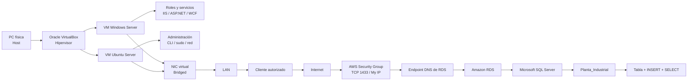
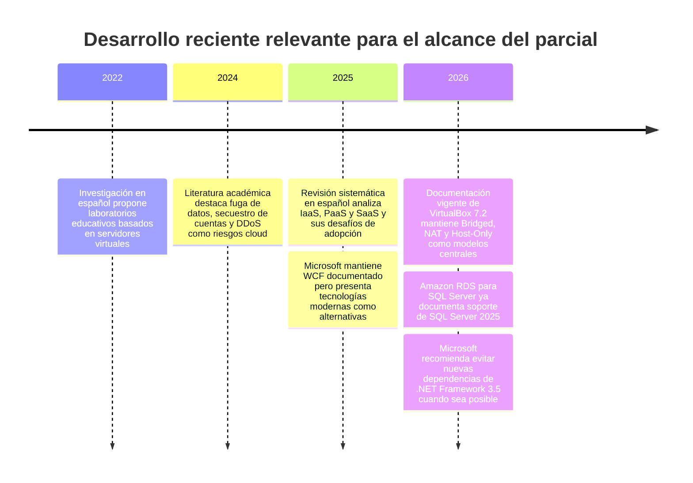
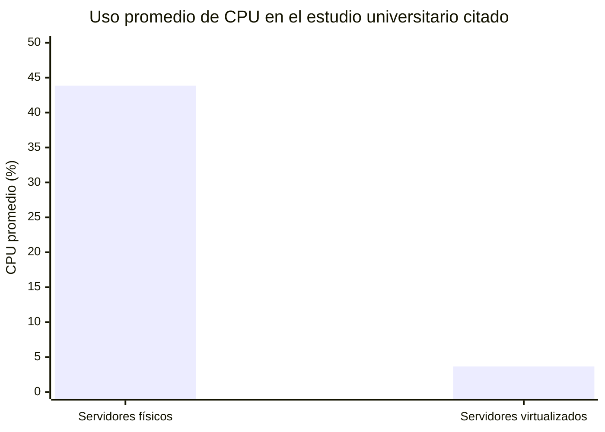

# Investigación integral para el Parcial N.º 1 de Informática Industrial: infraestructura industrial de local a la nube

## Resumen ejecutivo

Aunque la consigna general habla de “estos temas” como si no estuvieran especificados, el archivo adjunto **sí define con precisión once ejes de investigación** para el Parcial N.º 1: servidores de aplicación, virtualización, redes virtuales en modo Bridged, roles de Windows Server, Ubuntu Server y CLI, Cloud Computing, Security Groups y TCP 1433, Amazon RDS para SQL Server, bases de datos relacionales, Transact-SQL y la arquitectura integrada “de local a la nube”. El mismo documento delimita expresamente el alcance y excluye por ahora SCADA/HMI, IoT, Big Data, IA/ML y contenidos de las unidades posteriores. Por esa razón, este informe toma esos once ejes como el alcance efectivo y no propone temas alternativos. fileciteturn0file0

La idea central que unifica todo el parcial puede expresarse así:

> **Una PC física puede actuar como host de servidores virtualizados; esos servidores obtienen recursos virtuales y conectividad de red; uno puede prestar servicios de aplicación y otro demostrar administración mediante CLI; luego una función que antes podría residir localmente —la base de datos— puede consumirse como servicio administrado en la nube, donde la conectividad, la autenticación y las reglas de seguridad determinan qué clientes pueden acceder.**

Esa secuencia no es solamente una colección de tecnologías. Es una demostración de **capas de infraestructura**. En local intervienen hardware físico, VirtualBox, máquinas virtuales, sistemas operativos, servicios y aplicaciones. En la nube, Amazon RDS abstrae buena parte del hardware, sistema operativo y mantenimiento del motor, pero el usuario sigue siendo responsable de aspectos como conectividad autorizada, credenciales, usuarios, estructura de datos y uso de la base. AWS describe precisamente Cloud Computing como provisión bajo demanda de recursos de TI y diferencia IaaS, PaaS y SaaS por cuánto administra el proveedor frente al usuario. citeturn6search4turn6search5

**VirtualBox en modo Bridged es particularmente importante para la defensa.** Oracle documenta que una VM configurada como Bridged se comporta en la red como si estuviera conectada mediante su propia interfaz: puede comunicarse con el host, otras máquinas virtuales y equipos de la LAN, mientras que NAT sitúa al guest detrás de traducción de direcciones y Host-Only lo restringe esencialmente al host y a otras VM de esa red. Por ello, Bridged es una elección coherente cuando el objetivo del laboratorio es demostrar que el servidor virtual es accesible desde otros equipos. citeturn0search0turn0search1

**Windows Server y Ubuntu Server representan dos formas distintas de operar infraestructura, no dos conceptos de servidor distintos.** Windows Server expone administración de roles y características desde Server Manager; IIS puede hospedar aplicaciones web y ASP.NET, mientras WCF representa comunicación orientada a servicios. Ubuntu Server demuestra que un servidor no requiere entorno gráfico: puede configurarse, verificarse y administrarse mediante terminal, shell y utilidades de línea de comandos. Microsoft documenta Server Manager como consola central para instalar y administrar roles y características, mientras Canonical estructura su documentación de Ubuntu Server alrededor de administración del sistema, CLI, redes y seguridad. citeturn4search1turn1search13turn1search0turn0search2

**En AWS, el punto crítico no es solamente “crear una base de datos”, sino entender el recorrido de una conexión.** Un cliente necesita el endpoint DNS y puerto de la instancia RDS; el Security Group debe permitir tráfico entrante desde un origen autorizado; para SQL Server el puerto predeterminado es TCP 1433; y la autenticación del motor sigue siendo una capa distinta del filtrado de red. AWS define “Mi IP” como la IPv4 pública del equipo desde el que se configura la regla, mientras que `0.0.0.0/0` representa cualquier dirección IPv4 y, por ello, amplía radicalmente la superficie de exposición. citeturn2search14turn0search8turn3search3

El bloque de bases de datos debe defenderse desde tres niveles. Una **base de datos** es el conjunto estructurado de datos; el **SGBD/DBMS**, en este caso Microsoft SQL Server, es el software que gestiona esas bases; y **T-SQL** es el dialecto de SQL utilizado por SQL Server. En la práctica del parcial, `CREATE DATABASE` crea `Planta_Industrial`, `CREATE TABLE` define su estructura, `INSERT` agrega registros y `SELECT` recupera los datos para verificar el resultado. Microsoft confirma que `CREATE DATABASE` crea una base, `INSERT` agrega filas y `SELECT` recupera filas. citeturn8search1turn8search0turn6search6

La principal conclusión para la defensa oral es que conviene **explicar el parcial como un recorrido de abstracción creciente**:



La arquitectura del diagrama se corresponde con el funcionamiento documentado de Bridged en VirtualBox y con el modelo de conexión de RDS para SQL Server, donde el cliente utiliza endpoint y puerto y el Security Group debe permitir el tráfico de origen. citeturn0search1turn3search3turn2search4


## Definición del tema y alcance

El objeto de estudio es la **infraestructura informática industrial básica necesaria para desplegar y conectar servicios, desde un laboratorio local virtualizado hasta una base de datos administrada en la nube**. No se estudia todavía automatización industrial avanzada; el calificativo “industrial” describe el contexto de uso de la infraestructura: aplicaciones internas, información de producción, registros de fallas, eventos, trazabilidad, mantenimiento u otros datos de planta. El alcance deriva directamente de los once prompts del material entregado. fileciteturn0file0

La primera distinción fundamental es entre varias acepciones de “servidor”:

| Concepto | Qué significa | Ejemplo del parcial |
|---|---|---|
| **Servidor como hardware** | Equipo físico que aporta CPU, RAM, almacenamiento y red para ejecutar cargas de servidor. | La PC física podría cumplir esta función directamente, aunque en el TP actúa principalmente como host. |
| **Sistema operativo servidor** | SO preparado para administrar recursos y prestar servicios a otros equipos. | Windows Server o Ubuntu Server. |
| **Servicio servidor** | Proceso que escucha o responde a solicitudes de clientes mediante algún mecanismo de comunicación. | IIS, un servicio de archivos o el motor SQL Server. |
| **Aplicación servidor** | Software que implementa lógica y ofrece funciones o datos a clientes. | Una aplicación ASP.NET interna o una API. |
| **Servidor de aplicación** | Entorno que ejecuta y expone aplicaciones o lógica de negocio a clientes. | Windows Server con IIS/ASP.NET/WCF, según la aplicación instalada. |

Por tanto, **“servidor de aplicación industrial” no implica necesariamente un hardware especial**. Es, conceptualmente, un servidor de aplicaciones situado dentro de una arquitectura informática utilizada por una organización industrial. IIS, por ejemplo, puede publicar un sitio o aplicación en Internet o intranet; WCF permite implementar puntos de servicio que intercambian información entre aplicaciones. citeturn1search4turn1search1

Un servidor industrial interesa por atributos como **disponibilidad, conectividad, seguridad, administración, escalabilidad y mantenibilidad**. No basta con que “funcione”: debe poder ser accedido por los clientes correctos, impedir accesos indebidos, ser administrable y mantener un comportamiento predecible. La importancia de esos criterios se vuelve evidente al pasar de una VM aislada a Bridged y luego a un recurso cloud accesible mediante Internet. Oracle advierte expresamente que una VM Bridged adquiere acceso equivalente al de un equipo de esa red y puede requerir firewall, mientras la literatura reciente sobre cloud identifica control de acceso, visibilidad y seguridad como cuestiones esenciales. citeturn0search10turn7search2

**Virtualización** significa que una capa de software presenta a un sistema invitado recursos computacionales que aparentan ser hardware propio. Los términos básicos son:

- **Host:** máquina física y sistema anfitrión donde corre VirtualBox.
- **Guest:** sistema operativo que corre dentro de una VM.
- **VM:** entorno virtual que recibe CPU, RAM, disco y dispositivos virtualizados.
- **ISO:** imagen utilizada habitualmente como medio de instalación del sistema operativo.
- **Disco virtual:** archivo o conjunto de archivos que la VM percibe como almacenamiento.
- **Hipervisor:** capa que crea y administra las máquinas virtuales. En el laboratorio, VirtualBox cumple esa función.

Oracle documenta que la configuración de cada VM determina, entre otros elementos, cuánta memoria y cuántos procesadores virtuales se presentan al guest, además de dispositivos y características habilitadas. citeturn0search10

Virtualizar proporciona **aislamiento, portabilidad, consolidación y facilidad para laboratorios**, porque permite ejecutar más de un sistema operativo sin dedicar un equipo físico a cada uno. Esa utilidad educativa aparece también en investigación académica en español: un trabajo de la UNAM propuso en 2022 un laboratorio basado en servidores virtuales precisamente para permitir prácticas y configuración de servicios en un entorno controlado. citeturn7search14

No obstante, una VM no elimina restricciones físicas. CPU, RAM, almacenamiento y red siguen procediendo finalmente del host. Si se asignan más recursos de los disponibles o varias VM compiten intensamente por ellos, puede degradarse el rendimiento. También existe una dependencia de disponibilidad: si el host falla y no existe alta disponibilidad en otro nivel, las VM de ese host dejan de prestar servicio.

La red en **Bridged** completa el concepto. Oracle explica que VirtualBox conecta la NIC virtual con una interfaz instalada en el host e intercambia paquetes directamente con la red; desde el punto de vista de la LAN, el guest puede aparentar estar físicamente conectado. citeturn0search0turn0search1

La comparación esencial para el parcial es:

| Modo | VM → LAN/Internet | LAN → VM | Uso conceptual |
|---|---:|---:|---|
| **Bridged** | Sí | Sí | Servidor que debe aparecer como otro equipo de la LAN. |
| **NAT** | Sí | No directamente, salvo redirección de puertos | Guest que necesita salida sin exposición directa. |
| **Host-Only** | No hacia la LAN externa | Host ↔ VM | Laboratorio aislado entre host y VM. |

La propia tabla comparativa de Oracle muestra comunicación directa host↔VM, VM↔VM y VM↔LAN en Bridged; con NAT, el acceso entrante requiere port forwarding; Host-Only no llega a la red externa. citeturn0search1

En términos de direccionamiento, si la LAN utiliza DHCP y la VM en Bridged participa de esa misma red, puede obtener una configuración IP coherente con ella: **dirección IP, máscara, gateway y DNS**. El gateway permite alcanzar otras redes; DNS traduce nombres a direcciones; DHCP automatiza el suministro de parámetros. Lo importante para la defensa no es memorizar protocolos avanzados, sino poder explicar por qué una VM con dirección de la LAN puede ser accedida por otros equipos.

En Windows se puede verificar con herramientas como `ipconfig` y `ping`; en Linux, con `ip addr`, `ip route`, `ping` y herramientas de resolución de nombres. Ubuntu Server documenta que su configuración de red se administra actualmente mediante Netplan y cubre DNS, DHCP y las interfaces de red. citeturn0search4

La transición posterior a la nube no elimina esta lógica de capas. El NIST define Cloud Computing como acceso bajo demanda a un conjunto compartido de recursos configurables que pueden aprovisionarse y liberarse rápidamente, y formaliza los modelos IaaS, PaaS y SaaS. citeturn6search0turn6search2

En el parcial, RDS se entiende mejor como un **servicio administrado de base de datos**, no simplemente como “una computadora remota”. AWS administra gran parte del aprovisionamiento, parcheado, infraestructura y operaciones recurrentes del motor; el usuario consume una instancia de base de datos mediante parámetros de capacidad, conectividad y credenciales. citeturn2search13turn9search0

Por eso, **migrar a la nube no significa copiar una computadora a Internet**. Significa cambiar el modelo de responsabilidad y el nivel de abstracción: algunas capas que antes administraba la organización pasan a ser administradas por un proveedor.


## Metodología

La investigación siguió una estrategia de **triangulación documental**, con fecha de consulta al **22 de septiembre de 2026**.

Primero se utilizó el documento del parcial como **fuente de alcance**, porque determina exactamente qué debe estudiarse y, también importante, qué debe excluirse. fileciteturn0file0

Segundo, para cuestiones técnicas se priorizaron **fuentes primarias/oficiales**:

**Oracle** para virtualización y modos de red de VirtualBox; **Microsoft Learn** para Windows Server, IIS, .NET Framework, WCF, SQL Server y Transact-SQL; **Canonical** para Ubuntu Server; **AWS** para Cloud Computing, RDS, Security Groups, endpoints y SQL Server; y **NIST** para la definición formal de Cloud Computing. citeturn0search1turn4search1turn0search2turn2search11turn6search0

Tercero, se revisó literatura académica en español reciente para evitar que el análisis quedara reducido a documentación de proveedores. Se seleccionaron especialmente estudios sobre laboratorios virtualizados y seguridad/adopción cloud. La literatura académica sirve para contextualizar beneficios y riesgos, mientras la documentación oficial sigue siendo la fuente de autoridad para configuraciones concretas. citeturn7search14turn7search2turn7search0

El criterio de síntesis fue **aplicabilidad directa al parcial**. Por ejemplo, Kubernetes, contenedores, serverless e IA pueden ser desarrollos contemporáneos importantes, pero se excluyen porque el material de la materia indica que no forman parte de este parcial. fileciteturn0file0

La evolución relevante en los últimos cinco años puede sintetizarse así:



El trabajo sobre laboratorios virtuales es de 2022; el análisis de amenazas cloud fue publicado en 2024; la revisión sobre modelos de Cloud Computing fue publicada en 2025. En 2026, AWS documenta versiones de SQL Server 2025 en RDS y Microsoft caracteriza .NET Framework 3.5, publicado originalmente en 2008, como tecnología antigua que debería mantenerse principalmente cuando una aplicación existente la requiere. citeturn7search14turn7search2turn7search0turn2search11turn4search0

Esto introduce una distinción importante para la defensa: **que una característica sea antigua no significa que haya sido incorrecto instalarla en el TP**. Puede haberse instalado para reproducir requisitos de compatibilidad o demostrar un componente de una arquitectura Windows. La respuesta rigurosa sería: “.NET Framework 3.5 puede seguir siendo necesario para aplicaciones legadas; para proyectos nuevos Microsoft recomienda tecnologías más actuales”. citeturn4search0turn4search2


## Revisión de literatura y fuentes

La jerarquía recomendada para estudiar el parcial es **material de la cátedra → documentación oficial del fabricante → estándares → literatura académica reciente**. La documentación de terceros puede ayudar como explicación, pero no debería prevalecer sobre Oracle, Microsoft, Canonical o AWS cuando se pregunta cómo funciona específicamente un producto.

La siguiente tabla compara seis fuentes especialmente útiles:

| Fuente | Año / vigencia | Metodología o tipo de fuente | Hallazgo relevante para el parcial | Limitación |
|---|---:|---|---|---|
| **Oracle VirtualBox User Manual** citeturn0search1 | Vigente 2026 | Documentación primaria del producto | Bridged permite comunicación directa VM↔host↔LAN; NAT necesita port forwarding para conexiones entrantes. | Es documentación técnica, no un estudio comparativo independiente. |
| **Microsoft Learn — Server Manager, IIS, WCF y .NET** citeturn4search1turn1search13turn1search1turn4search0 | 2025–2026 | Documentación primaria | Define administración de roles, arquitectura IIS, WCF y compatibilidad de .NET. | Cubre una plataforma mucho más amplia que la utilizada en el TP. |
| **Ubuntu Server Documentation** citeturn0search2turn0search4 | Vigente 2026 | Documentación primaria | Administración de servidor, terminal, red, DNS, DHCP y seguridad. | La documentación actual puede diferir en detalles de versiones antiguas usadas en laboratorio. |
| **AWS RDS/VPC Documentation** citeturn2search4turn2search9turn3search3 | Vigente 2026 | Documentación primaria | Endpoint + puerto + Security Group forman parte esencial de la conectividad; SQL Server usa normalmente TCP 1433. | Describe múltiples arquitecturas; el parcial utiliza solo una configuración simplificada. |
| **Vicencio Nava y Venegas Guzmán, UNAM** citeturn7search14 | 2022 | Propuesta metodológica aplicada | La virtualización permite construir laboratorios de servidores en entornos controlados para desarrollar competencias prácticas. | Contexto educativo, no planta industrial en producción. |
| **Peña-Robayo y Moreno, Revista Vínculos** citeturn7search2 | 2024 | Revisión/análisis de amenazas | La nube añade riesgos como fuga de datos, secuestro de cuentas y DDoS y requiere políticas y monitoreo. | Es general sobre cloud; no evalúa específicamente RDS/SQL Server. |

La literatura académica española reciente respalda dos ideas centrales de los TP. Primero, que la virtualización es adecuada para laboratorios porque permite practicar configuraciones de infraestructura sin requerir un equipo físico dedicado por servidor. citeturn7search14 Segundo, que la transición a cloud cambia los riesgos y hace necesario mantener controles de acceso y gobernanza; no existe una “seguridad automática” por el simple hecho de utilizar un proveedor cloud. citeturn7search2turn7search5

En Cloud Computing, una revisión sistemática de 2025 en español identifica IaaS, PaaS y SaaS como modelos principales y resalta simultáneamente beneficios de adopción y barreras relacionadas con infraestructura, recursos y organización. Aunque su dominio empírico es educación superior, resulta útil para entender que **el modelo cloud cambia quién administra cada capa**, que es exactamente lo que debe poder justificarse al comparar un SQL Server local con RDS. citeturn7search0

En virtualización, además, existe evidencia empírica que merece interpretarse con cuidado. Un estudio reciente de la Universidad Nacional del Altiplano comparó tres servidores físicos y tres virtualizados y observó un consumo medio de CPU de **43,85 % en los físicos frente a 3,66 % en los virtualizados** bajo las cargas examinadas. Los autores encontraron una diferencia estadísticamente significativa, pero su muestra fue solo de seis servidores y el contexto fue universitario; por tanto, los valores **no deben generalizarse diciendo que “virtualizar siempre reduce la CPU 12 veces”**. Sí sirven como caso ilustrativo de que consolidación y asignación de recursos pueden mejorar eficiencia en ciertas cargas. citeturn7search16



La correcta lectura académica del gráfico es: **resultado de un estudio de caso, no ley universal de virtualización**. En aplicaciones industriales de alta demanda, latencia estricta o fuerte uso de E/S, el resultado puede ser diferente.


## Análisis de datos y estudios de caso

El análisis puede organizarse como una comparación entre **infraestructura local física, infraestructura local virtualizada y base de datos administrada en cloud**.

| Dimensión | Servidor físico local | Servidor en VM local | Amazon RDS SQL Server |
|---|---|---|---|
| Hardware | Organización | Host de la organización | AWS |
| Virtualización | Puede no existir | VirtualBox/host | AWS |
| Sistema operativo base | Organización | Organización | AWS administra la plataforma subyacente |
| Motor/servicio | Organización | Organización | AWS gestiona gran parte de la operación del motor |
| Datos y esquema | Organización | Organización | Usuario/organización |
| Credenciales y permisos lógicos | Organización | Organización | Usuario/organización |
| Conectividad de acceso | LAN/firewall | NIC virtual + LAN/firewall | VPC + Security Group + endpoint |
| Escalado | Compra/configuración de hardware | Limitado por el host | Cambio de recursos/servicio según opciones de RDS |
| Dependencia de Internet | No necesariamente | No necesariamente | Sí para un cliente externo a AWS |
| Costo | CapEx + operación | CapEx + operación | Consumo del servicio |

AWS señala que RDS se encarga de tareas como aprovisionamiento, backups y parcheado que en una instalación autogestionada recaerían sobre el administrador; esto no elimina responsabilidades sobre el diseño, acceso y uso de la base. citeturn2search13turn9search0

**Windows Server como servidor de aplicación.** Server Manager permite instalar y desinstalar roles y características tanto local como remotamente. IIS procesa solicitudes web mediante componentes como HTTP.sys, el servicio WWW y WAS, y se integra con ASP.NET. WCF permite construir aplicaciones orientadas a servicios y puede alojarse en IIS. citeturn4search1turn1search13turn1search1

Una forma correcta de defender los componentes del TP es:

| Componente | Función conceptual | Por qué tiene sentido en el TP | Ejemplo industrial sencillo |
|---|---|---|---|
| **IIS** | Servidor web y plataforma de hospedaje | Demuestra que Windows Server presta un servicio a clientes | Web interna de mantenimiento |
| **ASP.NET** | Entorno para aplicaciones web .NET | Permite que IIS ejecute aplicaciones dinámicas | Registro de órdenes o fallas |
| **.NET Framework 3.5 / 4.x** | Runtime requerido por determinadas aplicaciones | Compatibilidad con software .NET | Aplicación industrial existente |
| **WCF Services** | Comunicación orientada a servicios | Ejemplifica intercambio entre cliente y servidor | Servicio que entrega información de producción |
| **ISAPI Extensions** | Integración/extensión del procesamiento en IIS | Forma parte de capacidades del servidor web | Componente web heredado |
| **IIS Management Console** | Administración de IIS | Configuración y gestión del servidor | Crear/revisar un sitio interno |
| **File and Print Services** | Compartir archivos/impresión por red | Ejemplo clásico de servicio de infraestructura | Carpeta compartida de documentos |
| **Remote Desktop Services** | Acceso remoto a sesiones/administración | Administración sin presencia física; opcional en el TP | Administrar servidor desde oficina técnica |

IIS está explícitamente diseñado para hospedar contenido en Internet o intranet, y WCF puede operar con endpoints de servicio alojados en IIS. citeturn1search4turn1search1

Sobre **.NET Framework**, conviene evitar una respuesta histórica incorrecta. En 2026 Microsoft señala que .NET Framework 3.5 es tecnología antigua y aconseja buscar versiones más modernas cuando sea posible; Windows Server 2022 incluye .NET Framework 4.8 y puede admitir 4.8.1, mientras Windows Server 2025 incluye 4.8.1. Esto convierte a 3.5 fundamentalmente en una cuestión de compatibilidad con aplicaciones que aún lo requieren. citeturn4search0turn4search2

**Ubuntu Server y CLI.** Una terminal es la interfaz donde el usuario interactúa; la **shell** es el intérprete que recibe comandos; la **CLI** es el paradigma de interacción mediante texto. Un servidor no necesita un escritorio gráfico para cumplir su función: servicios, configuración, red y procesos pueden administrarse desde la shell. Canonical incluye explícitamente en la documentación de Ubuntu Server secciones sobre línea de comandos, redes, seguridad y administración del sistema. citeturn0search2

`sudo` permite ejecutar una operación con privilegios elevados según la política configurada. Para la defensa basta entender que no todas las tareas deben realizarse permanentemente como administrador/root; se elevan privilegios cuando una acción lo requiere.

Comandos defendibles por su utilidad conceptual:

```bash
hostname
hostnamectl
date
ip addr
ip route
ping <destino>
ls
pwd
ps
systemctl status <servicio>
```

No es necesario memorizar decenas de comandos. Es mejor poder responder **qué verifica cada uno**: identidad, hora, interfaces, rutas, conectividad, archivos, procesos o estado de servicios.

**Caso de red Bridged.** La cadena conceptual es:

```text
NIC física del host
        ↓
filtro/bridge de VirtualBox
        ↓
NIC virtual presentada a la VM
        ↓
TCP/IP del guest
        ↓
dirección de la LAN
        ↓
otros equipos pueden alcanzar el servidor
```

Oracle explica literalmente a nivel arquitectónico que VirtualBox intercepta/inserta tráfico sobre la interfaz física, creando para el guest una interfaz que aparenta conexión física a la red. citeturn0search0

El riesgo es igualmente importante: Bridged **expone más directamente la VM a la LAN**. Oracle recomienda considerar firewall porque el guest tiene acceso de red comparable al host. citeturn0search10

**Caso Cloud: de SQL Server local a RDS.** AWS define RDS como la capa donde se crea una “instancia de base de datos”; al aprovisionarla se eligen motor, almacenamiento, CPU/memoria, redes y otras propiedades. Para SQL Server, el motor seleccionado continúa siendo Microsoft SQL Server aunque la infraestructura subyacente sea operada por AWS. citeturn9search0turn2search11

El **endpoint** no es “la base de datos” ni una contraseña. Es el nombre DNS mediante el cual un cliente localiza la instancia, asociado además a un puerto. AWS especifica que para conectarse con un cliente SQL son necesarios endpoint y puerto; en SSMS el endpoint y el puerto pueden proporcionarse en el nombre del servidor. citeturn3search0turn3search3turn3search4

Por tanto:

```text
Cliente SQL
   ↓
resolución DNS del endpoint
   ↓
red / Internet
   ↓
regla del Security Group
   ↓ TCP 1433 permitido desde origen autorizado
Amazon RDS
   ↓
motor Microsoft SQL Server
   ↓
autenticación SQL
   ↓
Planta_Industrial
```

El **Security Group** y la **autenticación SQL son controles distintos**. El Security Group determina qué tráfico de red puede alcanzar el recurso; la autenticación decide si las credenciales presentadas al motor son válidas. Un firewall del sistema operativo sería otra capa diferente. AWS describe el Security Group como firewall virtual que controla tráfico entrante y saliente según origen/destino, protocolo y puerto. citeturn2search4

La regla del TP —**TCP 1433 desde “Mi IP”**— se justifica mediante **mínimo privilegio de red**. AWS documenta 1433 como puerto predeterminado de SQL Server y define “Mi IP” como la IPv4 pública del equipo local. `0.0.0.0/0`, por contraste, significa cualquier IPv4 y AWS advierte que una regla así permite acceso desde cualquier dirección mediante el protocolo/puerto autorizado. citeturn0search8turn2search14turn2search4

No obstante, hay una precisión importante: **“My IP” no es identidad personal ni autenticación permanente**. Es una dirección IP pública observada en ese momento. Si el proveedor de Internet cambia la IP, la regla puede dejar de coincidir y habrá que actualizarla.

También conviene distinguir **accesibilidad pública** de “puerto abierto”. Para conectar desde un equipo situado fuera de la VPC, RDS debe ser alcanzable desde ese origen; AWS señala que una instancia privada solo es accesible desde recursos con conectividad dentro de la VPC, mientras que una conexión externa requiere la arquitectura de acceso correspondiente. citeturn3search7turn3search8

**Bases de datos y SQL.** Una base de datos relacional organiza información en tablas compuestas por filas y columnas. Una **clave primaria** identifica de forma única cada fila. En una implementación simple de planta, una tabla `Fallas` puede representar eventos de mantenimiento sin introducir todavía SCADA ni historiadores.

Las categorías SQL útiles para la defensa son:

| Categoría | Qué hace | Sentencias del parcial |
|---|---|---|
| **DDL** | Define estructura | `CREATE DATABASE`, `CREATE TABLE` |
| **DML** | Modifica datos | `INSERT` |
| **Consulta** | Recupera información | `SELECT` |

Microsoft documenta `SELECT` como la sentencia utilizada para recuperar filas e `INSERT` como la operación para añadir una o más filas. citeturn6search6turn8search0

Un script deliberadamente simple y defendible sería:

```sql
CREATE DATABASE Planta_Industrial;
GO

USE Planta_Industrial;
GO

CREATE TABLE Fallas (
    IdFalla INT IDENTITY(1,1) PRIMARY KEY,
    Equipo VARCHAR(50) NOT NULL,
    Descripcion VARCHAR(150) NOT NULL,
    FechaHora DATETIME2 NOT NULL,
    Estado VARCHAR(20) NOT NULL
);
GO

INSERT INTO Fallas (Equipo, Descripcion, FechaHora, Estado)
VALUES
    ('Bomba_01', 'Sobretemperatura', '2026-09-20 10:15:00', 'Resuelta'),
    ('Motor_02', 'Vibracion elevada', '2026-09-20 11:40:00', 'Pendiente');
GO

SELECT IdFalla, Equipo, Descripcion, FechaHora, Estado
FROM Fallas;
GO
```

`CREATE DATABASE` crea la base, `CREATE TABLE` define su estructura, `INSERT` carga los registros y `SELECT` permite observarlos. Es coherente con las funciones que Microsoft documenta para las respectivas sentencias. citeturn8search1turn8search3turn8search0turn6search6

La salida esperada sería conceptualmente:

| IdFalla | Equipo | Descripción | FechaHora | Estado |
|---:|---|---|---|---|
| 1 | Bomba_01 | Sobretemperatura | 2026-09-20 10:15 | Resuelta |
| 2 | Motor_02 | Vibracion elevada | 2026-09-20 11:40 | Pendiente |

Si esa consulta se ejecutó **desde un cliente remoto conectado al endpoint RDS**, observar las filas demuestra conjuntamente varias cosas: hubo resolución del endpoint, conectividad hasta AWS, el Security Group admitió la conexión, las credenciales fueron aceptadas, el motor ejecutó T-SQL y los datos quedaron almacenados. No demuestra por sí sola que “toda la seguridad está bien configurada”, pero sí valida funcionalmente el recorrido de conexión. AWS confirma que un cliente estándar como SSMS puede conectarse a la instancia RDS una vez que ésta está disponible, accesible y sus reglas permiten la fuente. citeturn3search3


## Síntesis, conclusiones y recomendaciones prácticas

La conclusión técnica principal es que el parcial puede defenderse como **un modelo por capas**:

**Capa física:** la PC aporta recursos reales.

**Capa de virtualización:** VirtualBox transforma esos recursos en CPU, RAM, disco y NIC virtuales para cada guest. citeturn0search10

**Capa de sistema operativo:** Windows Server y Ubuntu Server administran los recursos virtuales como si fueran propios.

**Capa de servicios:** Windows puede ofrecer IIS/aplicaciones; Ubuntu demuestra administración de servicios y red vía CLI. citeturn1search13turn0search2

**Capa de red local:** Bridged integra las VM a la LAN de manera que pueden funcionar como equipos accesibles por otros clientes. citeturn0search1

**Capa cloud:** AWS proporciona recursos de TI como servicio y RDS administra gran parte de la plataforma de base de datos. citeturn6search4turn2search13

**Capa de seguridad de red:** el Security Group determina qué origen/protocolo/puerto puede llegar al recurso. citeturn2search4

**Capa de direccionamiento cloud:** el endpoint DNS y el puerto indican al cliente dónde conectarse. citeturn3search3

**Capa lógica de datos:** SQL Server procesa T-SQL y almacena la base `Planta_Industrial`.

La comparación Windows/Ubuntu tampoco debería plantearse como “cuál es mejor”. Para este parcial representan **dos estrategias administrativas distintas**:

| Windows Server | Ubuntu Server |
|---|---|
| Administración fuertemente integrada con Server Manager y herramientas gráficas/PowerShell | Administración habitualmente basada en CLI y archivos/configuración declarativa |
| Roles y características como modelo visible de instalación | Paquetes y servicios como modelo habitual |
| IIS/.NET/WCF en el TP | CLI, hostname, red, fecha/hora en el TP |
| Puede administrarse también por terminal | Puede disponer de GUI, pero no la necesita para funcionar como servidor |

Microsoft documenta Server Manager como herramienta centralizada para roles y características; Canonical estructura Ubuntu Server como sistema administrable plenamente desde línea de comandos. citeturn4search1turn0search2

La comparación local/cloud más útil es tampoco caer en el error “cloud siempre es mejor”. La literatura reciente señala beneficios potenciales en aprovisionamiento y escalabilidad, pero también riesgos de seguridad, costos, gobernanza y dependencia del proveedor. citeturn7search2turn7search9

**Recomendaciones prácticas para la defensa oral:**

Primero, utilizar siempre vocabulario preciso. No decir “VirtualBox da Internet”; decir que **VirtualBox presenta una NIC virtual y, según el modo seleccionado, conecta esa NIC con una determinada topología de red**. citeturn0search1

Segundo, no afirmar que Bridged “copia la IP del host”. La VM normalmente tiene **su propia configuración IP** dentro de la LAN. El hecho de compartir la interfaz física del host no implica compartir necesariamente la misma dirección de capa 3.

Tercero, no decir que un Security Group “es la contraseña”. Es un **control de tráfico de red**; la autenticación SQL sigue ocurriendo posteriormente. citeturn2search4turn3search4

Cuarto, no identificar endpoint con IP fija. El endpoint es un **nombre DNS administrado**, y el cliente debe usar ese nombre en lugar de construir dependencias con una IP física concreta. AWS caracteriza el endpoint precisamente mediante nombre DNS y número de puerto. citeturn3search0

Quinto, distinguir instancia de RDS, motor y base:

```text
Amazon RDS              = servicio administrado
Instancia de RDS        = recurso de base de datos aprovisionado
Microsoft SQL Server    = motor/SGBD
Planta_Industrial       = base de datos lógica creada dentro del motor
Fallas                  = tabla dentro de esa base
```

Sexto, explicar “migrar a cloud” como **transferencia parcial de responsabilidades**, no como desaparición de responsabilidades. AWS puede administrar infraestructura, backups y mantenimiento del servicio, pero el usuario sigue teniendo que diseñar accesos, usuarios y datos correctamente. citeturn2search13turn9search0

**Cómo explicar todo el parcial en 5 minutos**

> “Partimos de una PC física que funciona como host. Sobre ella usamos Oracle VirtualBox, que es la capa de virtualización, para crear máquinas virtuales y asignarles CPU, RAM, almacenamiento y una NIC virtual. En una VM instalamos Windows Server y en otra Ubuntu Server.
>
> A las máquinas virtuales les configuramos la red en modo Bridged. Esto hace que la NIC virtual se conecte a la misma LAN mediante la interfaz física del host, por lo que la VM puede comportarse como otro equipo de la red y ser alcanzada desde otras máquinas. citeturn0search1
>
> Windows Server demuestra el concepto de servidor de aplicación. Mediante Server Manager se instalan roles y características; IIS presta servicios web, ASP.NET permite ejecutar aplicaciones web .NET y WCF representa servicios de comunicación entre aplicaciones. citeturn4search1turn1search13turn1search1
>
> Ubuntu Server demuestra que un servidor puede administrarse sin interfaz gráfica. Desde la CLI podemos verificar hostname, red, rutas, archivos, procesos y servicios. citeturn0search2
>
> Luego pasamos del entorno local al modelo Cloud Computing. En vez de instalar y mantener nosotros todo el servidor de base de datos, utilizamos Amazon RDS, un servicio administrado, y elegimos Microsoft SQL Server como motor. citeturn6search4turn2search13
>
> Para acceder remotamente necesitamos el endpoint DNS y el puerto de la instancia. SQL Server usa habitualmente TCP 1433. El Security Group permite ese puerto solo desde nuestra IP pública, aplicando mínimo privilegio; no conviene usar `0.0.0.0/0` porque permitiría conexiones desde cualquier IPv4. citeturn0search8turn2search14
>
> Una vez conectado el cliente SQL, ejecutamos T-SQL: `CREATE DATABASE` para crear `Planta_Industrial`, `CREATE TABLE` para definir una tabla, `INSERT` para cargar datos y `SELECT` para comprobarlos. Cuando aparecen los registros confirmamos que la conexión remota y las operaciones principales funcionaron. citeturn8search1turn8search0turn6search6
>
> Así el parcial muestra una arquitectura completa: hardware físico, virtualización, sistemas operativos servidor, red local, servicios, transición a cloud, seguridad de red y finalmente persistencia de información en una base de datos relacional.”

**Batería probable de preguntas de defensa**

| Pregunta | Respuesta técnica breve |
|---|---|
| ¿Un servidor es necesariamente una computadora física? | No. “Servidor” puede referirse al equipo, al sistema operativo o al software que presta un servicio. Una VM también puede funcionar como servidor. |
| ¿Qué hace VirtualBox? | Virtualiza recursos físicos y los presenta a sistemas guest como CPU, RAM, almacenamiento y dispositivos de red. |
| ¿Qué diferencia hay entre host y guest? | El host ejecuta VirtualBox; el guest es el sistema operativo de la VM. |
| ¿Qué es un hipervisor? | Es la capa que crea y administra entornos virtuales; en el laboratorio esa función la cumple VirtualBox. |
| ¿Por qué Bridged? | Porque necesitamos que la VM pueda aparecer como otro equipo de la LAN y ser alcanzada desde otras máquinas. citeturn0search1 |
| ¿Por qué no NAT? | NAT es adecuado para salida de la VM, pero el acceso entrante no es directo sin configurar redirección de puertos. citeturn0search1 |
| ¿La VM usa la misma IP que el host? | No necesariamente; en Bridged normalmente participa en la LAN con una dirección propia. |
| ¿Qué función cumple IIS? | Hospeda y atiende aplicaciones o contenido web en Windows Server. citeturn1search4 |
| ¿Para qué sirve ASP.NET? | Para ejecutar aplicaciones web basadas en .NET dentro del entorno correspondiente. |
| ¿Qué es WCF? | Un framework para crear aplicaciones orientadas a servicios y comunicación entre endpoints. citeturn1search1 |
| ¿Qué diferencia hay entre terminal, shell y CLI? | Terminal es la interfaz; shell es el intérprete; CLI es el modo de interacción mediante comandos. |
| ¿Por qué Ubuntu Server puede funcionar sin GUI? | Porque los servicios y la configuración pueden administrarse mediante CLI; un servidor no necesita escritorio para prestar servicios. citeturn0search2 |
| ¿Qué es Cloud Computing? | Provisión bajo demanda de recursos de TI mediante una infraestructura de servicios compartida y aprovisionable. citeturn6search0 |
| ¿Qué es IaaS? | Infraestructura de cómputo, almacenamiento y red consumida como servicio, con mayor control del cliente. citeturn6search5 |
| ¿Qué diferencia hay entre una VM con SQL Server y RDS? | En una VM administramos sistema y motor; en RDS AWS administra más capas operativas del servicio de base de datos. citeturn2search13 |
| ¿Qué es un Security Group? | Un control de red que permite o deniega tráfico según reglas de protocolo, puerto y origen/destino. citeturn2search4 |
| ¿Por qué puerto 1433? | Es el puerto TCP predeterminado utilizado para conexiones de Microsoft SQL Server. citeturn0search8turn2search9 |
| ¿Qué significa My IP? | La IPv4 pública del equipo desde el que se define la regla. citeturn2search14 |
| ¿Qué significa `0.0.0.0/0`? | Todas las direcciones IPv4; usarlo como origen expone el puerto a cualquier origen de Internet capaz de alcanzarlo. citeturn2search14 |
| ¿Qué es el endpoint de RDS? | El nombre DNS utilizado por el cliente para llegar a la instancia, asociado a un puerto. citeturn3search3 |
| ¿Security Group reemplaza la contraseña SQL? | No. Una capa autoriza el tráfico; otra autentica al usuario en SQL Server. |
| ¿Base de datos y SQL Server son lo mismo? | No. SQL Server es el SGBD/motor; `Planta_Industrial` es una base gestionada por ese motor. |
| ¿Qué hace `CREATE DATABASE`? | Crea una nueva base de datos. citeturn8search1 |
| ¿Qué hace `CREATE TABLE`? | Define una nueva tabla y sus columnas/restricciones. citeturn8search3 |
| ¿Qué hace `INSERT`? | Agrega filas. citeturn8search0 |
| ¿Qué hace `SELECT`? | Recupera filas o columnas para consultarlas. citeturn6search6 |
| ¿Qué demuestra ver los datos tras un `SELECT` remoto? | Que la conexión, autenticación, contexto de base y ejecución de la consulta funcionaron hasta devolver los datos. |


## Vacíos de investigación y preguntas abiertas

El principal vacío del parcial es deliberado: se estudia una **arquitectura didáctica**, no una infraestructura industrial de producción completa. El laboratorio demuestra correctamente las capas fundamentales, pero no mide por sí mismo disponibilidad, rendimiento, recuperación ante fallos, latencia, costos o comportamiento bajo carga. El estudio experimental sobre servidores físicos y virtualizados muestra precisamente por qué sería incorrecto extrapolar conclusiones de rendimiento sin una medición específica de la carga: incluso resultados estadísticamente fuertes siguen estando condicionados por hardware, workload, muestra y entorno. citeturn7search16

Otra cuestión abierta es **qué versión exacta de Windows Server, Ubuntu Server y VirtualBox se utilizó en los TP**. Conceptualmente no cambia el argumento principal, pero sí puede alterar rutas de configuración, versiones de .NET, herramientas y capturas. Por ejemplo, Microsoft indica diferencias entre Windows Server 2019, 2022 y 2025 respecto de las versiones de .NET Framework incluidas. citeturn4search2

También queda abierta la pregunta de **si las direcciones de las VM fueron entregadas por DHCP o configuradas estáticamente**. Para defender Bridged no es necesario asumir una de las dos; ambas son compatibles con el concepto. Lo correcto es describir exactamente lo observado en el TP.

En cloud, debe verificarse en la implementación concreta si la instancia RDS utilizada en la práctica fue **públicamente accesible** o si existió otro mecanismo de conectividad. AWS deja claro que conectar un cliente situado fuera de la VPC requiere que exista una ruta de acceso apropiada; una instancia privada no se vuelve accesible desde Internet simplemente por añadir una regla al Security Group. citeturn3search7turn9search0

Otra pregunta futura es cómo se gestionaría una IP pública dinámica. Una regla “My IP” puede dejar de funcionar cuando cambia la dirección pública. En una infraestructura real se podrían evaluar mecanismos de acceso privado o rangos corporativos controlados, pero desarrollarlos excedería el alcance fijado para este parcial.

Desde la perspectiva de software, **WCF y .NET Framework 3.5 merecen contextualización histórica**. WCF continúa documentado y es relevante para comprender aplicaciones existentes, pero Microsoft señala gRPC como alternativa moderna; .NET Framework 3.5 permanece principalmente por compatibilidad. Para la defensa esto no invalida el TP: simplemente distingue entre “tecnología que debo comprender porque forma parte de una implementación” y “tecnología que elegiría necesariamente para un proyecto nuevo en 2026”. citeturn1search1turn4search0

En seguridad, las preguntas abiertas más valiosas son: **¿qué ocurre si se abre 1433 a todo Internet?, ¿qué controla el Security Group y qué controla SQL Server?, ¿qué pasa cuando cambia la IP pública?, ¿cómo comprobar que una falla es de red y no de credenciales?, ¿qué capas continúan bajo responsabilidad del usuario cuando el motor está en RDS?** La investigación reciente en español confirma que fugas de datos, secuestro de cuentas, DDoS, visibilidad y complejidad operacional siguen siendo preocupaciones centrales en cloud, lo cual refuerza la importancia de no tratar la seguridad como una única configuración. citeturn7search2turn7search13

Finalmente, la base `Planta_Industrial` se mantiene deliberadamente simple. En una implementación industrial posterior podrían investigarse integridad referencial, restricciones, índices, respaldo, auditoría, concurrencia, recuperación y modelos de datos más complejos. Sin embargo, incorporarlos ahora debilitaría la defensa en lugar de fortalecerla: el objetivo inmediato es poder explicar con precisión la cadena **servidor → virtualización → red → cloud → seguridad → endpoint → SGBD → base → tabla → `INSERT` → `SELECT`**, exactamente dentro del alcance del Parcial N.º 1. fileciteturn0file0