<!-- Las imágenes de este documento se referencian mediante rutas relativas en assets/. -->

# Universidad Tecnológica Nacional

Facultad Regional Córdoba

Licenciatura en Automatización y Control · Informática Industrial

## Parcial N° 1

# Informe de Soporte

Proyecto integrador de infraestructura industrial: de servidores
virtuales en VMware a una base de datos administrada en AWS

## Integrantes

| **Integrante**         | **Legajo** |
|------------------------|------------|
| Casali, Emiliano       | 210237     |
| Del Soto, Gustavo      | 421822     |
| Ferrero, Facundo José  | 420841     |
| Vera, Cristian Gonzalo | 420581     |

Docente: Ing. Carolina Rivarola

Córdoba, 2026

## Índice del documento

1\. Introducción y objetivo general

2\. Bloque 1 — Infraestructura local y virtualización

2.1 TP1 — Instalación de Windows Server en VMware

2.2 TP2 — Instalación de Ubuntu Server en VMware

3\. Bloque 2 — Migración a la nube y ciberseguridad

3.1 Creación de la cuenta de AWS

3.2 Security Group: regla de entrada al puerto 1433

4\. Bloque 3 — Implementación en Amazon RDS

4.1 Creación de la instancia SQL Server Express

4.2 Conexión desde SQL Server Management Studio

4.3 Script Transact-SQL completo

5\. Conclusiones generales

# 1. Introducción y objetivo general

Este informe de soporte documenta, de forma técnica y formal, el trabajo
realizado por el grupo para el Parcial N° 1 de Informática Industrial:
el recorrido completo de una infraestructura industrial desde servidores
virtuales instalados en una PC personal hasta una base de datos
administrada en la nube. Reúne la memoria del paso a paso de los dos
trabajos prácticos de laboratorio (TP1, Windows Server, y TP2, Ubuntu
Server), la migración a AWS con su configuración de seguridad, la
implementación de la base de datos en Amazon RDS y el código completo de
los scripts Transact-SQL utilizados.

En ambos trabajos prácticos, la consigna original menciona VirtualBox
como hipervisor de referencia; el grupo utilizó **VMware Workstation
16**, que es igualmente un hipervisor de tipo 2 (hosted) y permite
exactamente las mismas configuraciones pedidas (memoria, disco, imagen
ISO y red en modo Bridged).

# 2. Bloque 1 — Infraestructura local y virtualización

## 2.1 TP1 — Instalación de Windows Server en VMware

El objetivo del práctico es instalar y configurar un servidor Windows
Server en una máquina virtual, dejándolo listo para configuraciones y
uso en un entorno de red: hora, nombre del equipo, red, roles y
características. La consigna menciona VirtualBox; se utilizó **VMware
Workstation 16 Pro**, que es también un hipervisor de tipo 2 (hosted) y
permite exactamente las mismas configuraciones pedidas (RAM, disco, ISO
y red en modo Bridged).

| **Elemento**      | **Valor**                                                                                           |
|-------------------|-----------------------------------------------------------------------------------------------------|
| Equipo anfitrión  | PC personal, Windows 11 (build 26200), 16 GB de RAM, conexión Wi-Fi                                 |
| Hipervisor        | VMware Workstation 16 Pro, versión 16.1.1 (build 17801498)                                          |
| Sistema invitado  | Windows Server 2022 Standard Evaluation (Experiencia de escritorio), en español                     |
| Imagen ISO        | SERVER_EVAL_x64FRE_es-es.iso (descarga oficial de Microsoft Evaluation Center)                      |
| Nombre de la VM   | TP1 II-LAC-WinServer2022                                                                            |
| Recursos          | 2 CPU, 4 GB de RAM (mínimo pedido: 2 GB), disco virtual de 40 GB, firmware UEFI                     |
| Red               | Bridged (VMnet0 asociada a la placa Wi-Fi física), IP 192.168.1.13/24, puerta de enlace 192.168.1.1 |
| Nombre del equipo | SRV-IND01 (usuario administrador: Administrador)                                                    |
| Zona horaria      | (UTC-03:00) Ciudad de Buenos Aires                                                                  |

### 2. Desarrollo paso a paso

#### Paso 1 - Software utilizado

Se verifica la versión del hipervisor instalada en el equipo anfitrión
(Help > About): VMware Workstation 16 Pro 16.1.1, con licencia activa.
Además se descargó la ISO de Windows Server 2022 Evaluation.

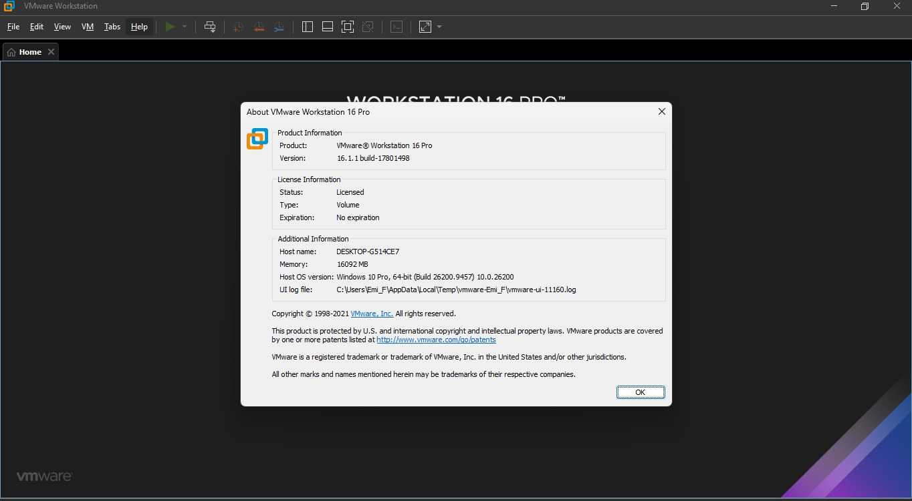

*CP1 - VMware Workstation 16 Pro 16.1.1 y datos del equipo anfitrión (16
GB de RAM).*

#### Paso 2 - Creación de la máquina virtual

Con el asistente (File > New Virtual Machine) se crea la VM con sistema
invitado Windows Server 2019/2022, 2 procesadores y 4096 MB de RAM (por
encima del mínimo de 2 GB). En el tipo de red se selecciona **"Use
bridged networking"**, como exige la consigna, para que la VM tome una
IP de la red local y pueda interactuar con otras máquinas.

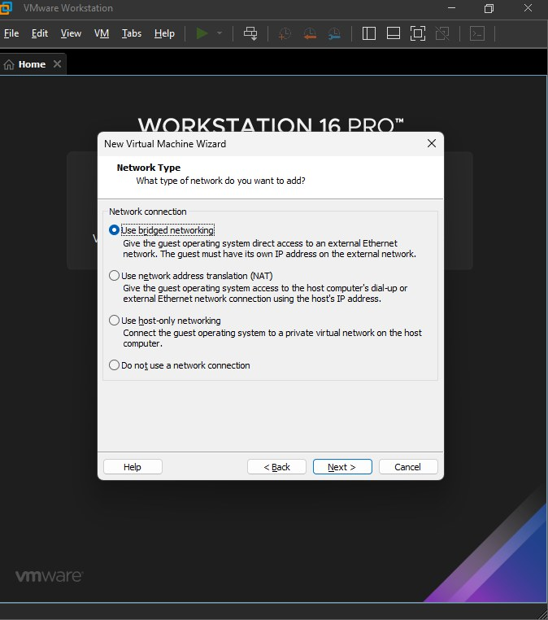

*CP2 - Tipo de red: Use bridged networking.*

#### Paso 3 - Disco virtual de 40 GB

Se asigna un disco virtual de 40 GB, dividido en múltiples archivos y
sin reservar todo el espacio de antemano (crece a medida que se usa). En
el resumen final se verifican todos los parámetros: 40 GB de disco, 4096
MB de memoria, red Bridged y 2 CPU.

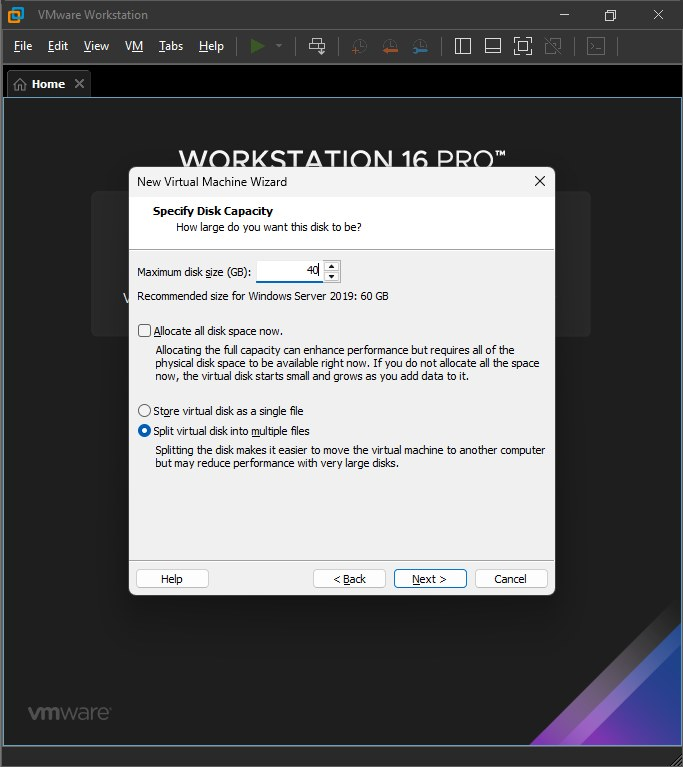

*CP3 - Capacidad máxima del disco: 40 GB.*

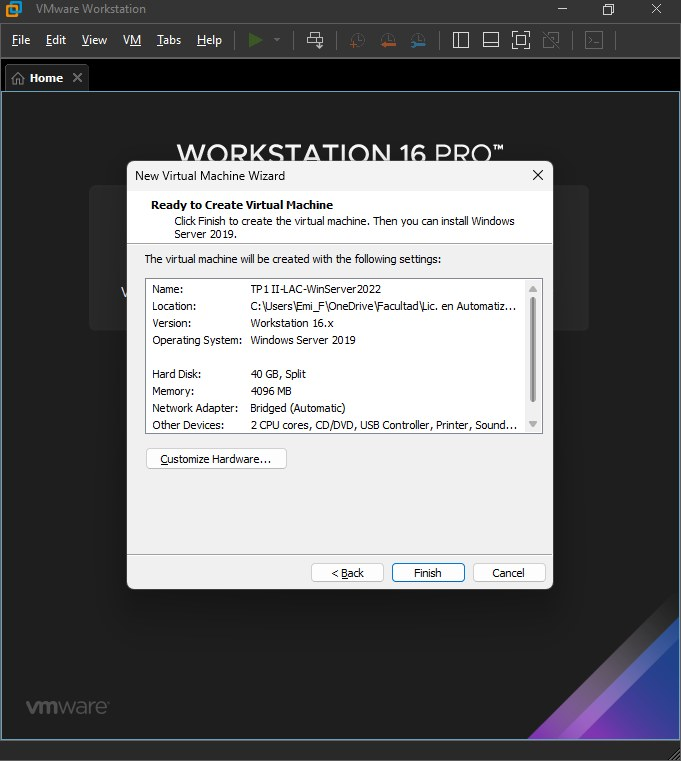

*CP4 - Resumen del asistente antes de crear la VM.*

#### Paso 4 - Selección de la imagen ISO

En Settings > CD/DVD se selecciona "Use ISO image file" y se apunta a
la ISO de Windows Server 2022, con "Connect at power on" activado. La VM
arranca desde esa imagen e inicia el instalador.

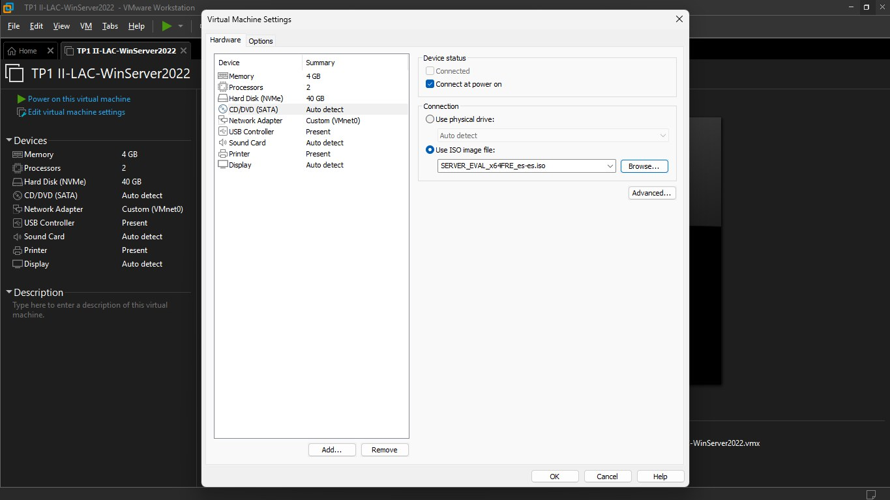

*CP6 - Configuración de la VM con la ISO montada (además se ven 4 GB de
RAM, 2 CPU y 40 GB de disco).*

#### Paso 5 - Instalación del sistema operativo

Se elige el idioma y se selecciona la edición **Windows Server 2022
Standard Evaluation (experiencia de escritorio)**. En la instalación
personalizada se utiliza el disco completo de 40 GB (el instalador crea
automáticamente las particiones de arranque, sistema y recuperación).

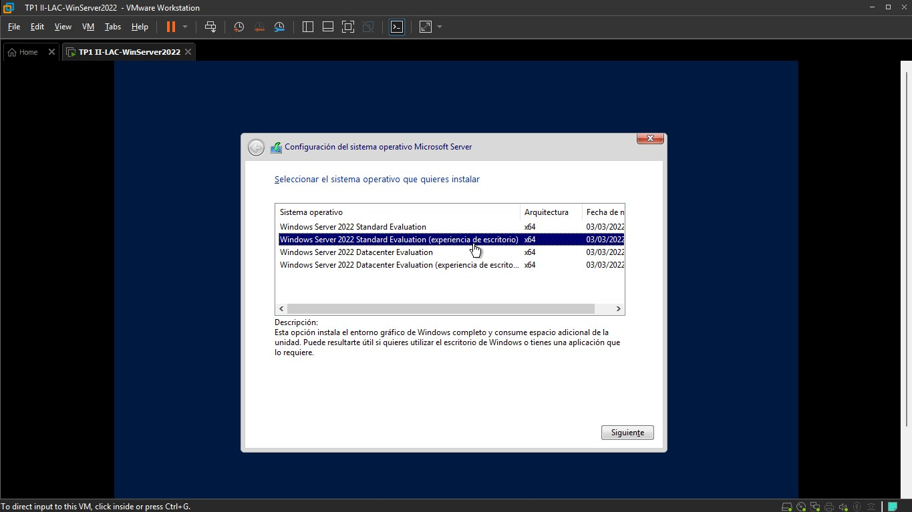

*CP7 - Selección del sistema operativo a instalar.*

#### Paso 6 - Cuenta de administrador

Al finalizar la instalación se define la contraseña de la cuenta
predeterminada **Administrador**. Windows exige complejidad (mayúsculas,
minúsculas, números y símbolos); en la captura se muestra el aviso
cuando la contraseña no cumplía los requisitos, y se eligió una que sí
los cumple. La contraseña se ocultó en la imagen.

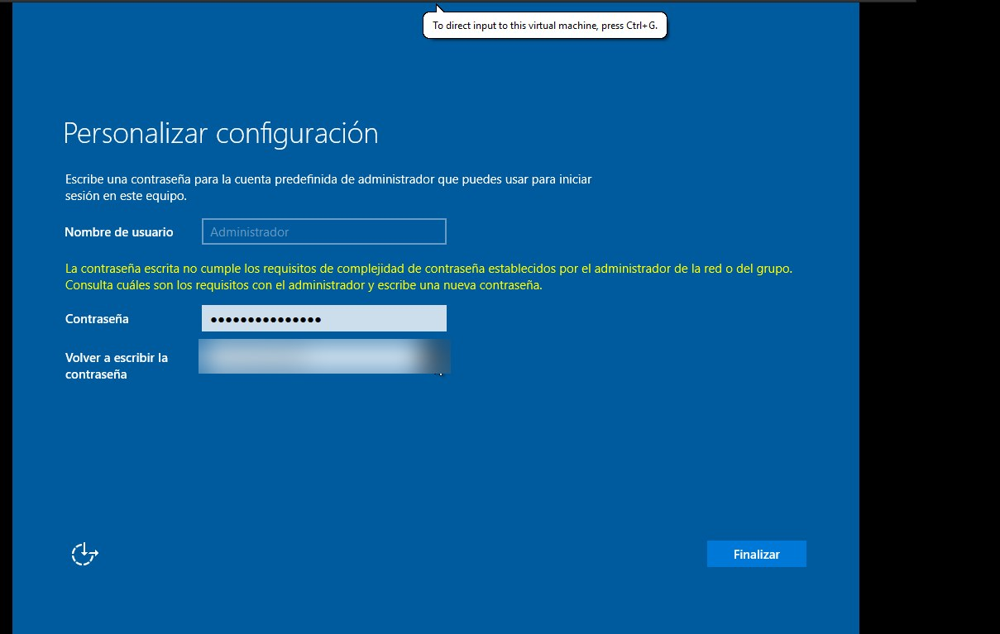

*CP8 - Creación de la contraseña del administrador (campo de
confirmación oculto).*

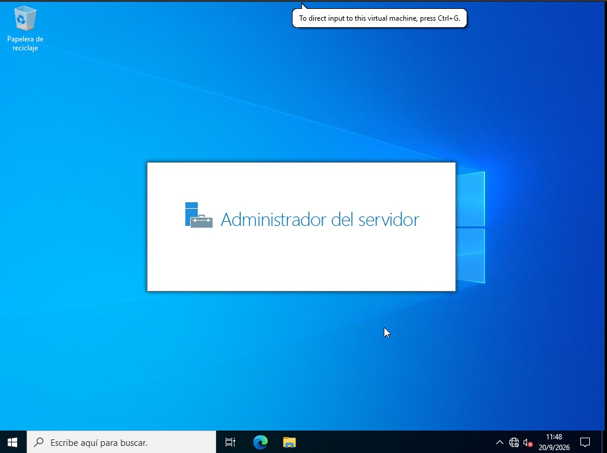

*CP9 - Primer inicio de sesión y arranque del Administrador del
servidor.*

#### Paso 7 - Verificación de consola y partición del disco

El servidor inicia correctamente y muestra el Administrador del
servidor. En Administración de discos se comprueba que el sistema
utiliza todo el espacio asignado: disco de 39,98 GB con las particiones
de arranque (100 MB), sistema C: de 39,33 GB en NTFS y recuperación (569
MB), más la unidad de DVD con la ISO.

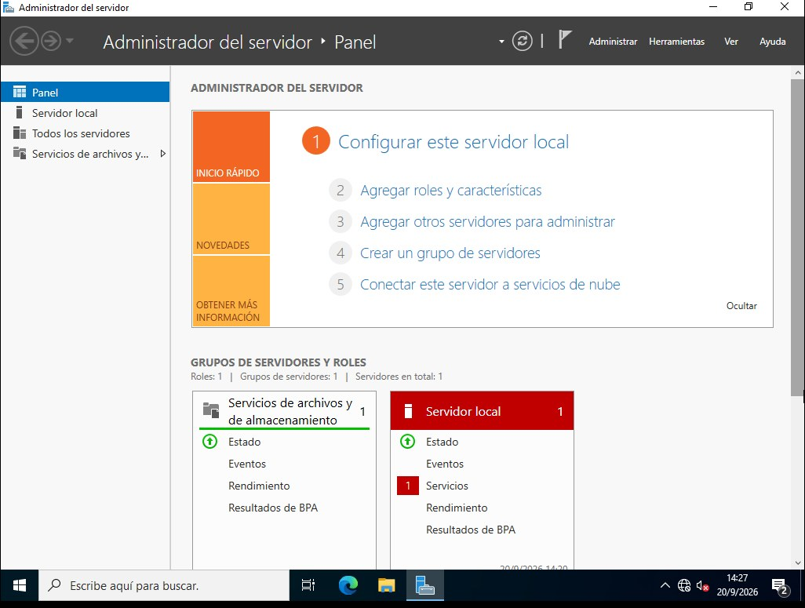

*CP10 - Administrador del servidor.*

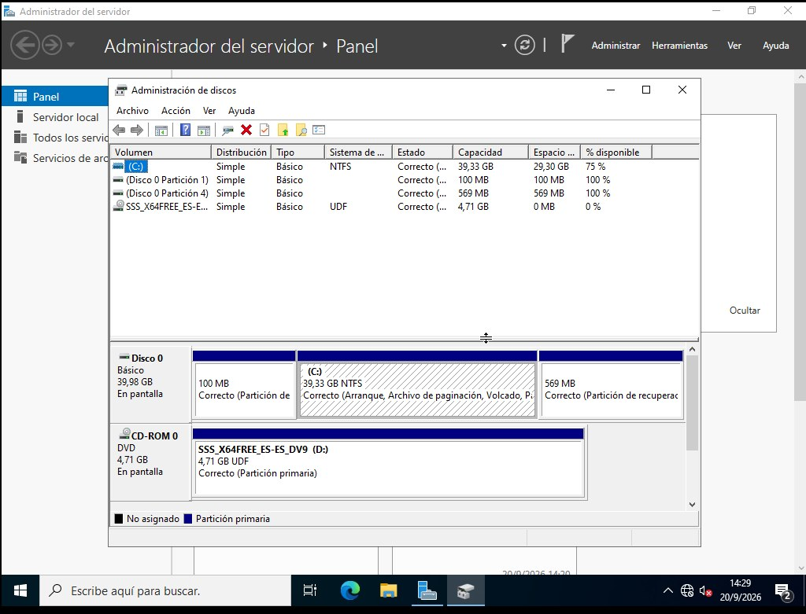

*CP11 - Administración de discos: 39,98 GB utilizados.*

#### Paso 8 - Hora, nombre del equipo y configuración regional

Desde PowerShell (como administrador) se ajusta la zona horaria y se
renombra el equipo:

```powershell
Set-TimeZone -Id "Argentina Standard Time"
Rename-Computer -NewName SRV-IND01 -Restart
```

Tras el reinicio se verifica con Get-TimeZone, hostname y Get-Date: zona
horaria de Buenos Aires, nombre SRV-IND01 y fecha/hora correctas.

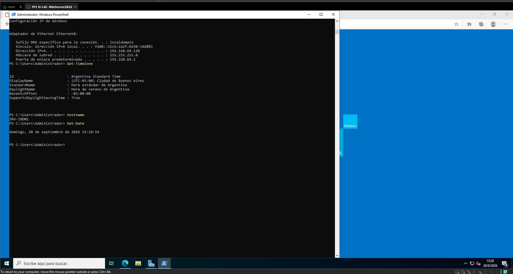

*CP24 - Zona horaria, nombre del equipo y fecha/hora configurados.*

#### Paso 9 - Configuración de red (modo Bridged)

La VM debe estar en la misma red que el equipo anfitrión. Para lograrlo,
en el Virtual Network Editor (ejecutado como administrador) se asoció la
red virtual VMnet0 a la placa Wi-Fi física (Intel Dual Band Wireless-AC
7265) y en la VM se dejó el adaptador en Bridged. Luego se reinició el
adaptador con Restart-NetAdapter -Name "Ethernet0". La VM pasó de la IP
192.168.64.128 (red NAT provisoria) a **192.168.1.13/24**, con puerta de
enlace 192.168.1.1, es decir, una dirección de la red local real.

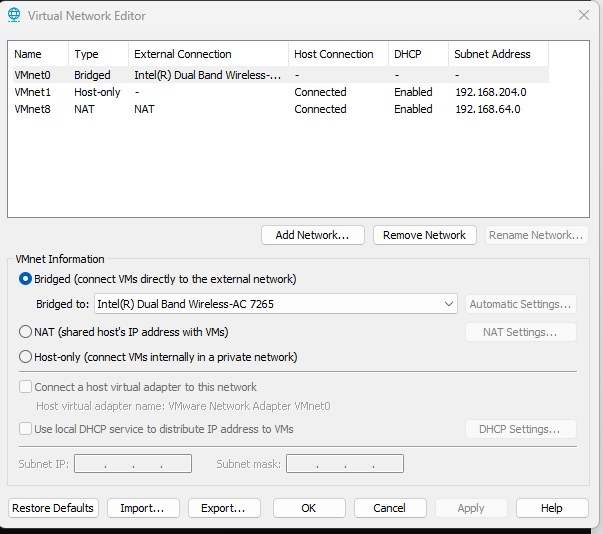

*CP22 - Virtual Network Editor: VMnet0 en modo Bridged hacia la placa
Wi-Fi física.*

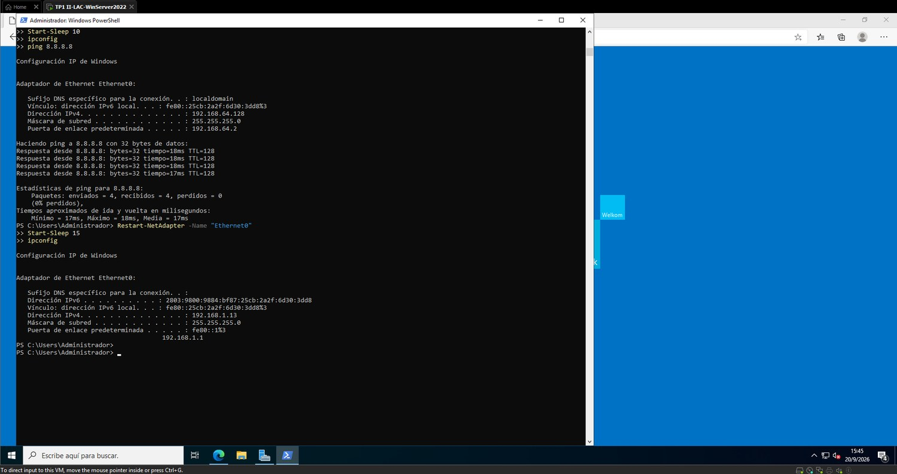

*CP23 - ipconfig antes (NAT) y después (Bridged) de aplicar el cambio.*

#### Paso 10 - Comunicación con otras máquinas

Se habilitó la regla de firewall que permite responder ping
(Enable-NetFirewallRule -Name FPS-ICMP4-ERQ-In) y se comprobó la
conectividad en ambos sentidos: desde la VM hacia Internet (8.8.8.8) y
desde la PC anfitrión hacia la VM, sin pérdida de paquetes.

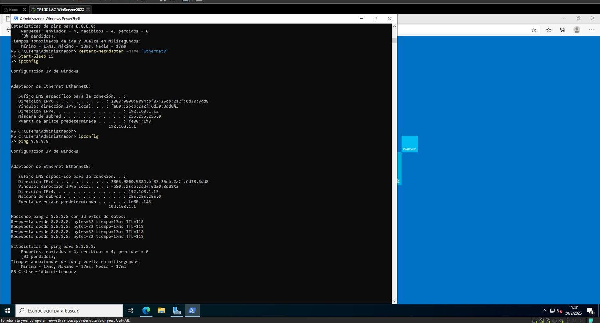

*CP26 - Desde la VM: ipconfig (192.168.1.13) y ping a 8.8.8.8 con 0% de
pérdida.*

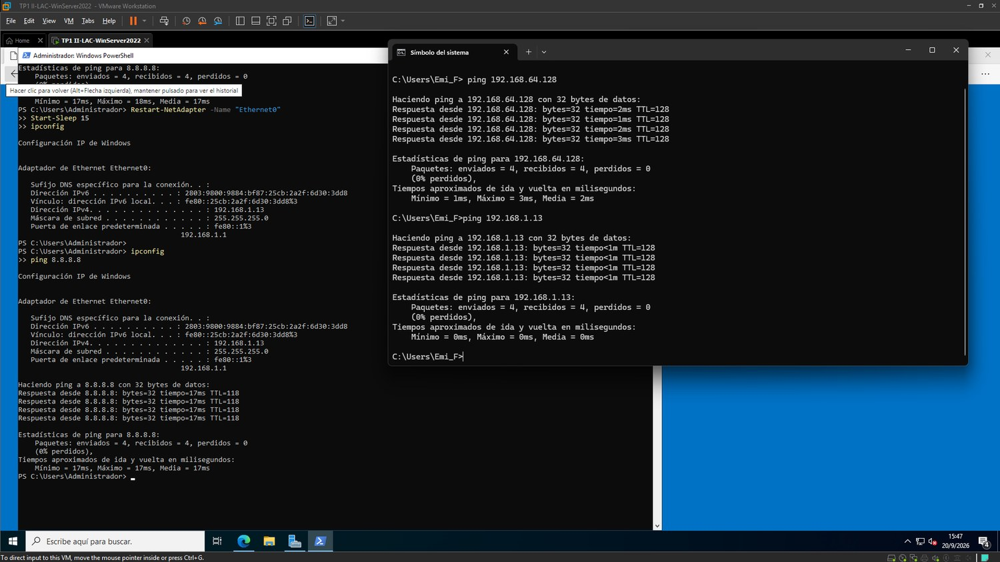

*CP27 - Desde la PC anfitrión: ping a la VM, antes (NAT, 192.168.64.128)
y después (Bridged, 192.168.1.13), sin pérdidas.*

#### Paso 11 - Roles y características instalados

Con PowerShell se instalaron los roles y características que pide la
consigna:

```powershell
Install-WindowsFeature Web-Server, Web-Asp-Net45, Web-ISAPI-Ext, Web-Mgmt-Console, NET-Framework-45-ASPNET, NET-WCF-Services45, FS-FileServer -IncludeManagementTools
Install-WindowsFeature NET-Framework-Core -Source D:\sources\sxs
Install-WindowsFeature Print-Services -IncludeManagementTools
```

> **Nota:** para .NET Framework 3.5 se utilizaron los archivos de la ISO como origen (`D:\sources\sxs`).

Con Get-WindowsFeature \| Where-Object Installed se listan las
características instaladas: .NET Framework 3.5 y 4.8, ASP.NET 4.8,
Servicios WCF, IIS (Servidor web) con ASP.NET, extensiones ISAPI y
Consola de administración, y Servicios de archivos y de impresión.

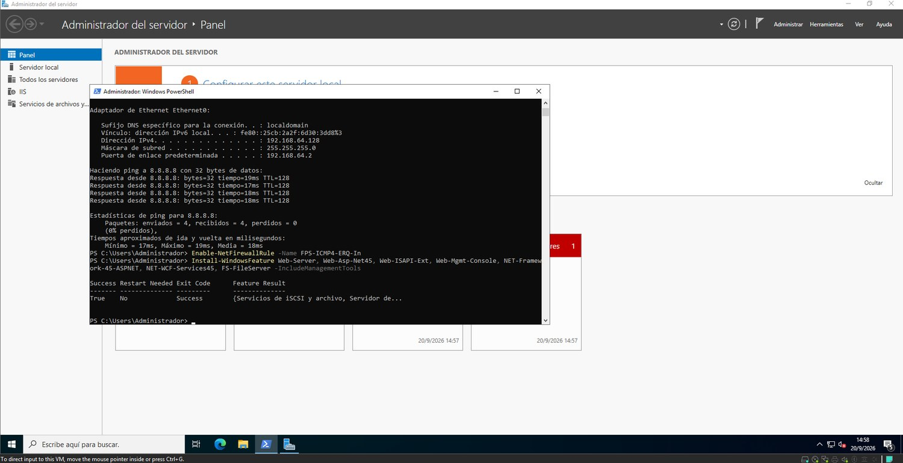

*CP15 - Instalación de roles: resultado Success.*

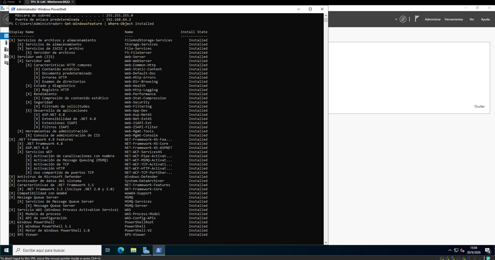

*CP16 - Listado de características instaladas (Get-WindowsFeature).*

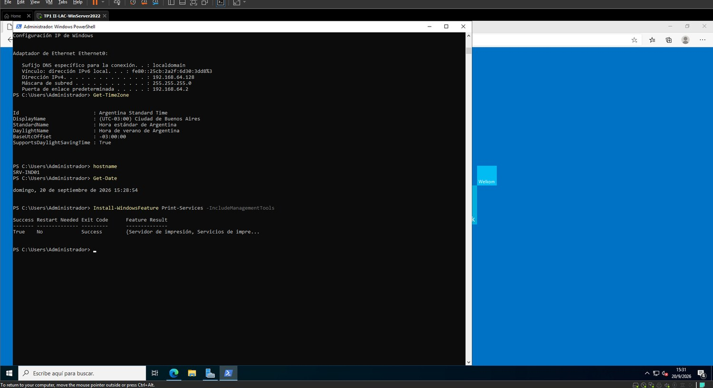

*CP25 - Instalación del servicio de impresión (Print-Services):
Success.*

#### Paso 12 - Verificación de IIS, ASP.NET y recurso compartido

Se comprobó el funcionamiento de los roles: la página de inicio de IIS
responde localmente y desde otra máquina de la red
(http://192.168.1.13); una página de prueba test.aspx confirma que
ASP.NET se ejecuta correctamente; y se creó la carpeta compartida
"Compartida" (New-SmbShare) para validar el rol de servicios de
archivos.

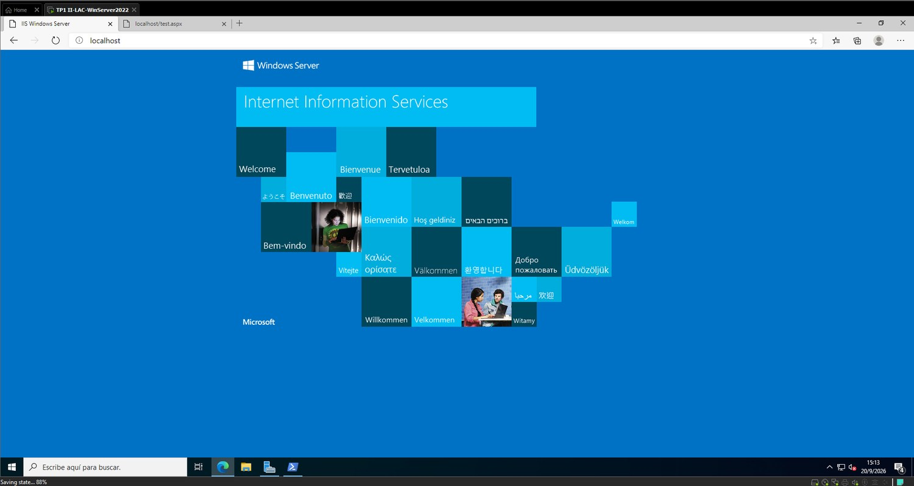

*CP17 - IIS funcionando localmente (localhost).*

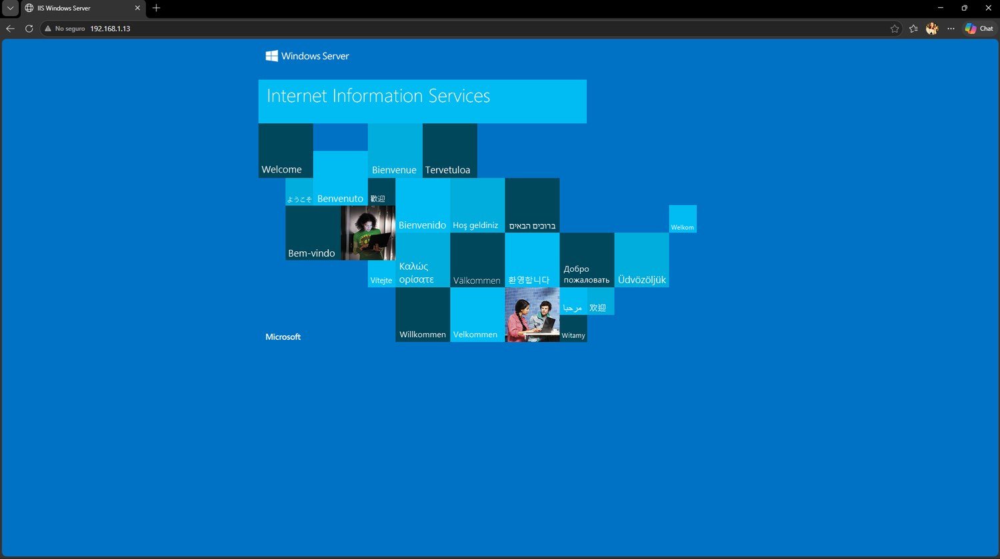

*CP28 - IIS accedido desde la PC anfitrión en http://192.168.1.13.*

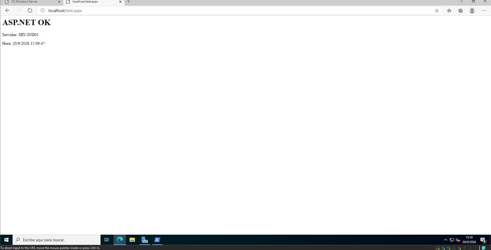

*CP19 - Página test.aspx: ASP.NET operativo (servidor SRV-IND01).*

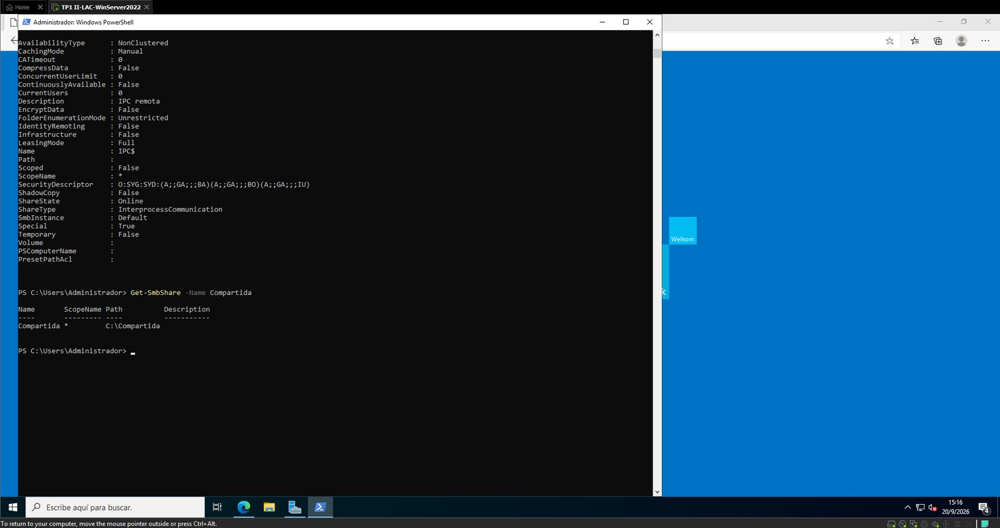

*CP20 - Recurso compartido "Compartida" verificado con Get-SmbShare.*

#### Paso 13 - Snapshots de la máquina virtual

Para poder volver atrás ante cualquier error y dejar la VM disponible
para revisión, se tomaron instantáneas (snapshots) en hitos importantes:
instalación base, roles e IIS completos y, finalmente, con la red en
modo Bridged.

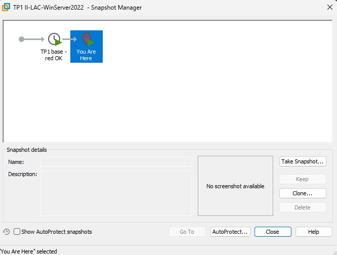

*CP14 - Snapshot de la instalación base.*

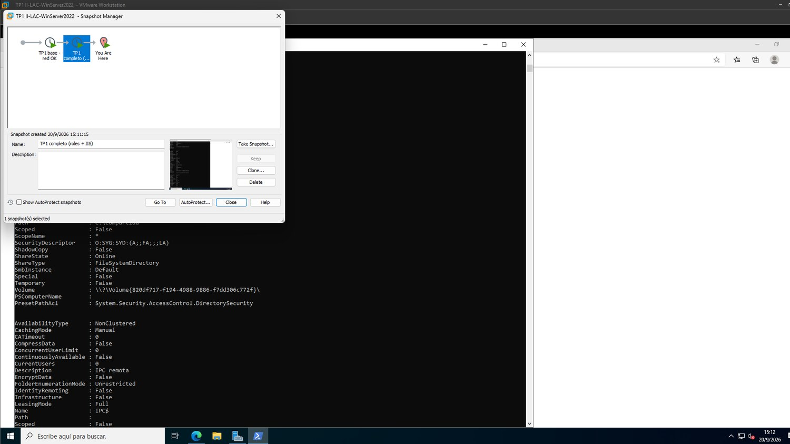

*CP21 - Snapshot con roles e IIS instalados.*

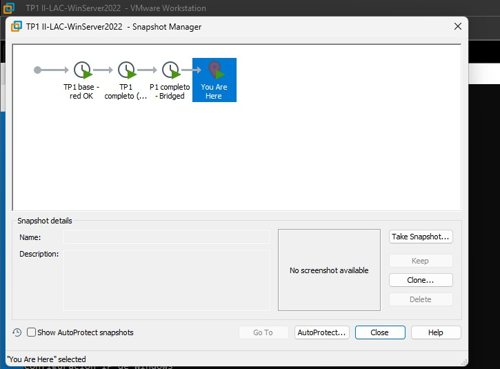

*CP29 - Snapshot final "TP1 completo - Bridged".*

### 3. Problemas encontrados y cómo se resolvieron

#### Problema 1 - La VM no arrancaba el instalador (EFI Network)

Al iniciar por primera vez la VM (firmware UEFI), apareció "EFI
Network... Time out" en lugar del instalador. Ocurre porque el mensaje
"Press any key to boot from CD or DVD" dura pocos segundos; si no se
presiona una tecla a tiempo, el firmware intenta arrancar por red.
**Solución:** reiniciar la VM y presionar una tecla apenas aparece el
mensaje.

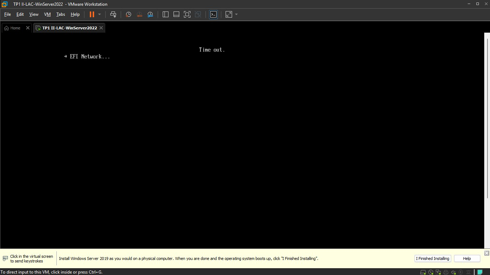

*Problema 1 - Arranque por red (EFI Network) por no presionar una tecla
a tiempo.*

#### Problema 2 - La VM en Bridged no obtenía dirección IP

Con el adaptador en Bridged, la VM quedó con una dirección APIPA
(169.254.x.x) y el ping no funcionaba, porque no recibía respuesta DHCP.
**Causa:** la red virtual VMnet0 estaba asociada al adaptador "Microsoft
Wi-Fi Direct Virtual Adapter" en lugar de la placa Wi-Fi real. Como
solución transitoria se usó la red NAT (IP 192.168.64.128), con la que
se comprobó salida a Internet y ping desde la PC anfitrión (previa
habilitación de la regla ICMP en el firewall). Luego se corrigió la
causa raíz: en el Virtual Network Editor (con permisos de administrador)
se seleccionó la placa correcta y se volvió a Bridged (ver Paso 9),
obteniéndose la IP 192.168.1.13.

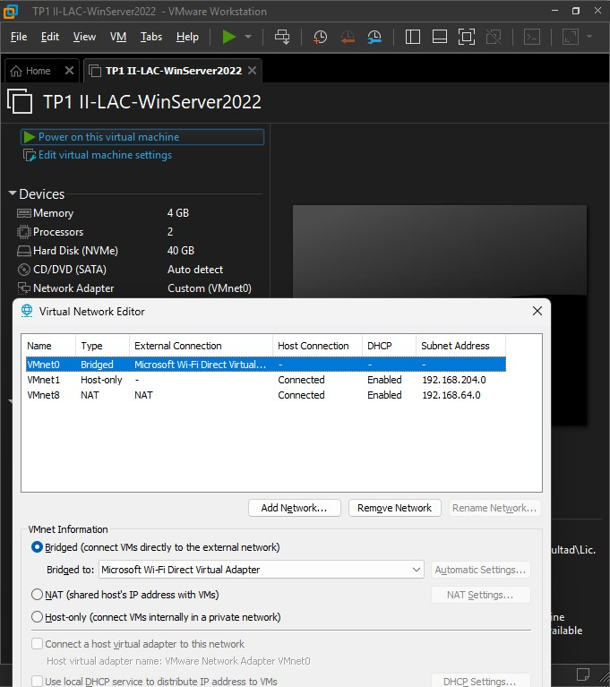

*Problema 2 - VMnet0 asociada al adaptador incorrecto (Wi-Fi Direct
Virtual).*

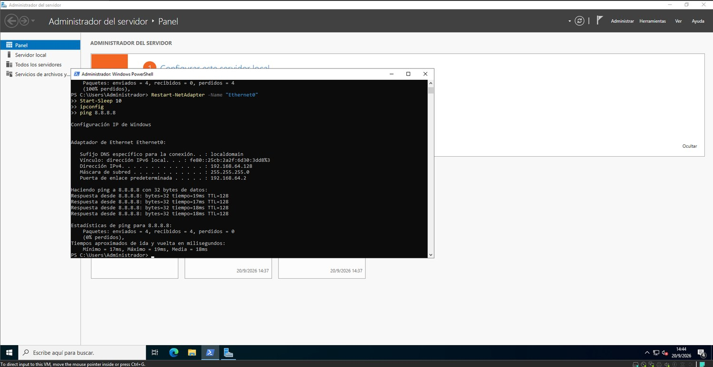

*Solución transitoria en NAT: IP 192.168.64.128 y ping a Internet
correcto.*

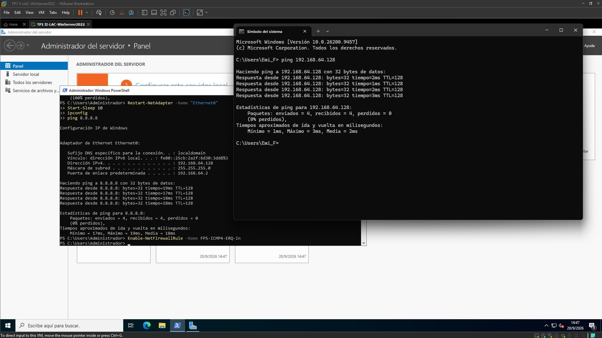

*Ping desde la PC anfitrión hacia la VM (NAT) y regla ICMP habilitada.*


*IIS accedido desde la PC anfitrión durante la prueba en NAT
(192.168.64.128).*

## 2.2 TP2 — Instalación de Ubuntu Server en VMware

### 1. Introducción

El objetivo de este trabajo práctico es instalar y configurar un
servidor Ubuntu Server en una máquina virtual, dejándolo como un
servidor Linux básico, listo para configuraciones y uso en un entorno de
red. La consigna menciona VirtualBox; se utilizó **VMware Workstation 16
Pro**, que es también un hipervisor de tipo 2 (hosted) y permite las
mismas configuraciones pedidas (RAM, disco, ISO y red en modo Bridged).
Es el mismo hipervisor utilizado en el TP1.

Ubuntu Server no tiene entorno gráfico: se instala y administra por
consola. Por eso, además de la consola de la máquina virtual, se utilizó
una conexión remota por **SSH** desde la PC anfitrión, que es la forma
habitual de administrar un servidor Linux y permitió copiar comandos sin
depender de la distribución de teclado de la consola virtual.

### Entorno de trabajo

| **Elemento**          | **Valor**                                                                                      |
|-----------------------|------------------------------------------------------------------------------------------------|
| Equipo anfitrión      | PC personal, Windows 11, 16 GB de RAM, conexión Wi-Fi                                          |
| Hipervisor            | VMware Workstation 16 Pro, versión 16.1.1                                                      |
| Sistema invitado      | Ubuntu Server 26.04.1 LTS (kernel Linux 7.0.0-31-generic, x86_64)                              |
| Nombre de la VM       | TP2 II-LAC-Ubuntu2404                                                                          |
| Recursos              | 2 CPU, 4 GB de RAM (mínimo pedido: 4 GB), disco virtual de 40 GB                               |
| Red                   | Bridged (VMnet0 asociada a la placa Wi-Fi física), IP 192.168.1.14/24 por DHCP, interfaz ens33 |
| Nombre del equipo     | srv-ubuntu01 (instalado como srvubuntu01 y luego corregido)                                    |
| Usuario administrador | emi (pertenece al grupo sudo)                                                                  |
| Zona horaria          | America/Argentina/Cordoba (UTC-03:00)                                                          |

### 2. Desarrollo paso a paso

#### Paso 1 - Creación de la máquina virtual

Con el asistente de VMware (File > New Virtual Machine) se crea la VM
con sistema invitado Ubuntu de 64 bits, 2 procesadores, **4096 MB de
RAM** y un **disco virtual de 40 GB** (dividido en archivos, sin
reservar todo el espacio de antemano). En la red se deja el adaptador en
modo **Bridged**, como pide la consigna, para que la VM tome una
dirección de la red local. En el resumen del asistente se verifican
todos los parámetros antes de finalizar.

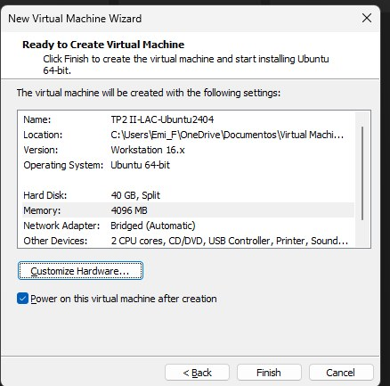

*Resumen del asistente: Ubuntu 64-bit, disco de 40 GB, 4096 MB de
memoria, red Bridged y 2 CPU.*

#### Paso 2 - Imagen ISO e inicio del instalador

Se descarga desde el sitio oficial de Ubuntu la imagen **Ubuntu Server
26.04.1 LTS** y se monta en la unidad de CD/DVD de la VM. Al encender la
máquina arranca el instalador en modo texto: se elige el idioma y la
distribución de teclado, y se continúa con las opciones predeterminadas
salvo donde se indica.

#### Paso 3 - Configuración de red durante la instalación

El instalador detecta la placa de red virtual (Intel 82545EM, interfaz
**ens33**) y le asigna por DHCP la dirección **192.168.1.14/24**, es
decir, una IP de la red local real. Esto confirma que el modo Bridged
funciona. Se deja la configuración predeterminada y se continúa (el
proxy queda vacío y se acepta el espejo de descarga por defecto).

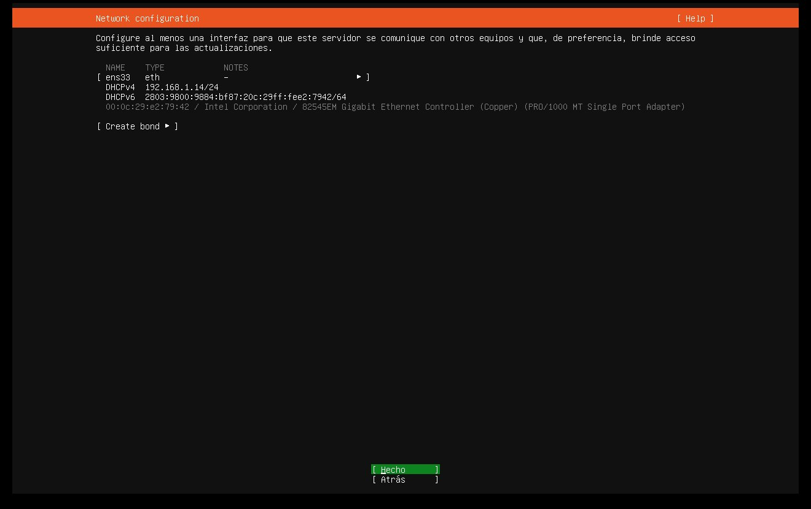

*Configuración de red del instalador: ens33 con DHCPv4 192.168.1.14/24.*

#### Paso 4 - Partición del disco

Para que el sistema utilice todo el espacio asignado se elige la opción
guiada **"Use an entire disk"** sobre el disco de 40 GB, con **LVM**
(administrador de volúmenes lógicos) y sin cifrado. El instalador crea
una partición de 1 MB para el gestor de arranque, una de 2 GB montada en
/boot y una tercera de 38 GB que se destina al grupo de volúmenes de
LVM. Por defecto el volumen lógico raíz (/) queda con aproximadamente la
mitad de ese espacio, por lo que más adelante se lo extiende para
aprovechar el disco completo (ver Paso 8).

#### Paso 5 - Perfil de usuario y nombre del servidor

Se completa el perfil del administrador: nombre real, nombre del
servidor, nombre de usuario (**emi**) y contraseña. La contraseña se
define con una longitud y complejidad adecuadas y no se muestra en la
captura (los campos de contraseña se dejaron vacíos al capturar). Este
usuario pertenece al grupo *sudo*, por lo que cuenta con privilegios
administrativos.

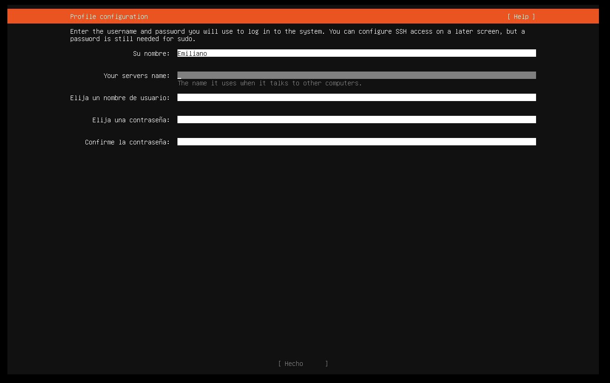

*Pantalla "Profile configuration" del instalador (contraseña no
expuesta).*

#### Paso 6 - Servidor SSH, instalación y reinicio

Se marca **Instalar servidor OpenSSH** (con autenticación por contraseña
habilitada) para poder administrar el servidor de forma remota, y no se
agrega ningún snap adicional. Con esto se inicia la copia de archivos y,
al finalizar, se reinicia la máquina y se quita el medio de instalación.

#### Paso 7 - Primer inicio y acceso a la consola

El servidor arranca correctamente y muestra el prompt de inicio de
sesión. Al ingresar con el usuario y la contraseña definidos se
visualiza el mensaje de bienvenida con la versión (**Ubuntu 26.04.1
LTS**, kernel 7.0.0-31), la carga del sistema, el uso de memoria y la
dirección IP 192.168.1.14 de la interfaz ens33. Se observa también que
el sistema de archivos raíz utilizaba **18,53 GB** de los 40 GB del
disco.

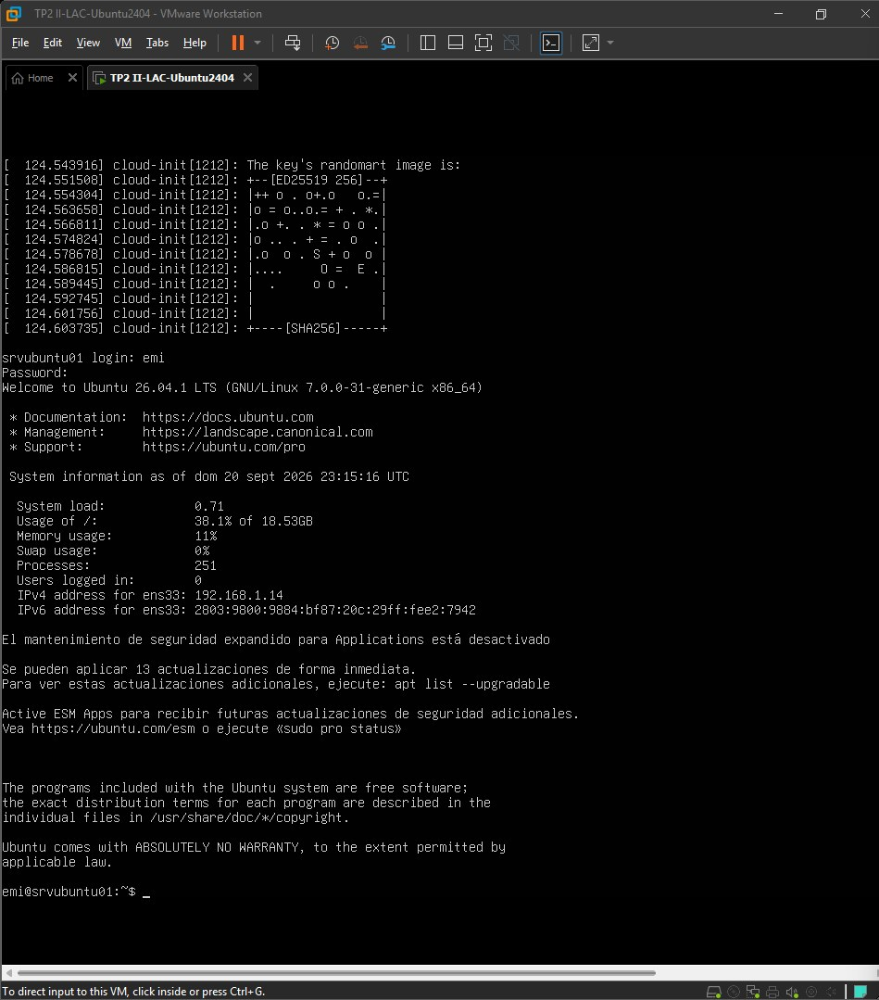

*Primer inicio de sesión en la consola de la VM: versión de Ubuntu, uso
de / (18,53 GB) e IP.*

#### Paso 8 - Acceso remoto por SSH y ampliación de la partición

Para el trabajo posterior se ingresó al servidor por SSH desde
PowerShell en la PC anfitrión, que además demuestra la comunicación de
red entre ambos equipos (ver Problema 2 sobre el teclado de la consola).

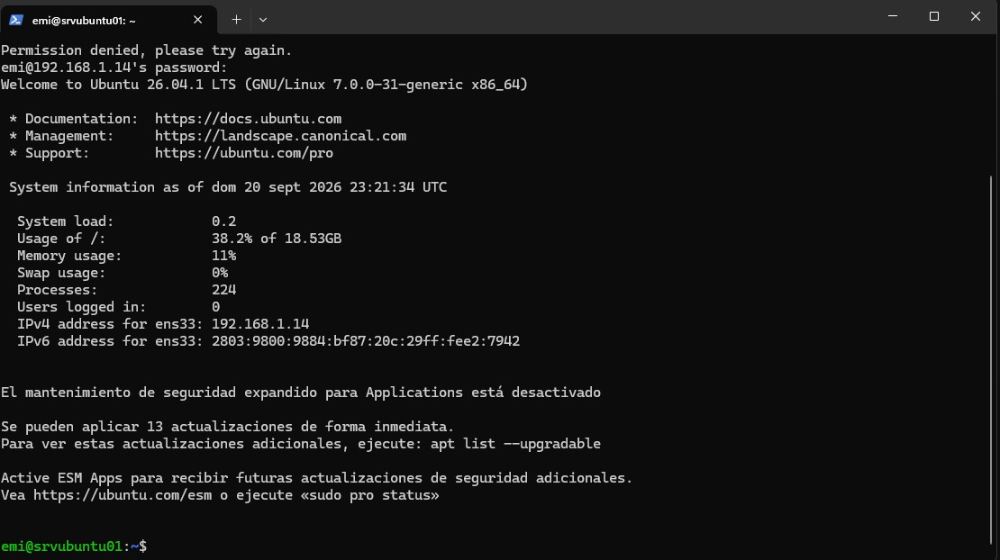

*Conexión por SSH desde la PC a 192.168.1.14 (el primer intento con
contraseña incorrecta fue rechazado).*

Con lsblk se verifica que el disco sda es de 40 GB, pero el volumen
lógico montado en / es de solo 19 GB. Se extiende el volumen lógico con
todo el espacio libre del grupo de volúmenes y luego se amplía el
sistema de archivos en línea, sin desmontar ni reiniciar:

lsblk

sudo lvextend -l +100%FREE /dev/ubuntu-vg/ubuntu-lv

sudo resize2fs /dev/ubuntu-vg/ubuntu-lv

df -h /

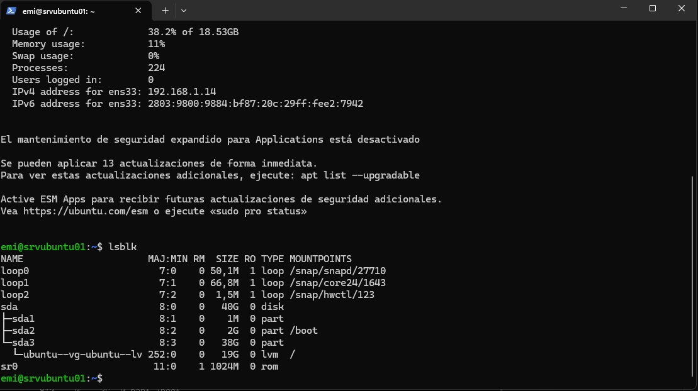

*lsblk antes de extender: sda de 40 GB, sda3 de 38 GB y ubuntu-lv de 19
GB.*

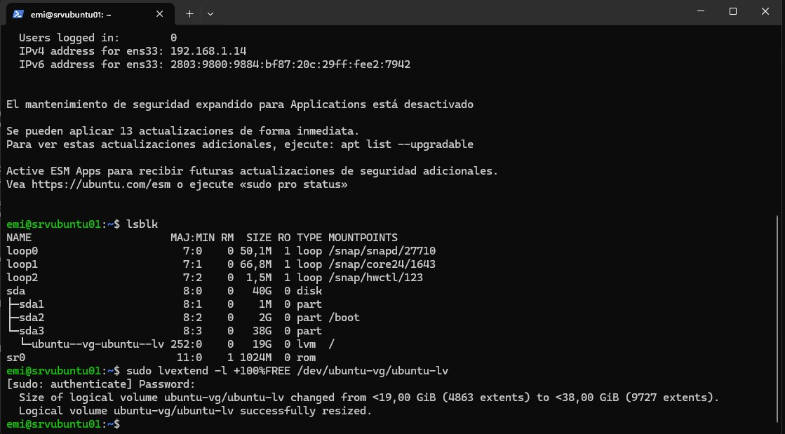

*lvextend: el volumen lógico pasa de 19 GiB a 38 GiB.*

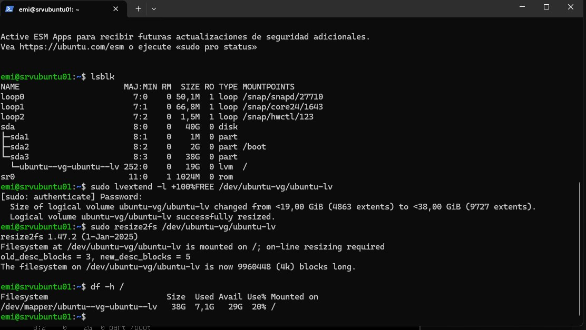

*resize2fs y df -h /: el sistema de archivos raíz ahora tiene 38 GB (29
GB libres).*

#### Paso 9 - Configuración de la hora

Con timedatectl se comprueba que la zona horaria estaba en UTC (hora del
instalador) y se la cambia a la de Córdoba, Argentina (UTC-03:00). La
captura muestra el antes (Etc/UTC, 23:24) y el después
(America/Argentina/Cordoba, 20:24), con el reloj sincronizado por NTP.

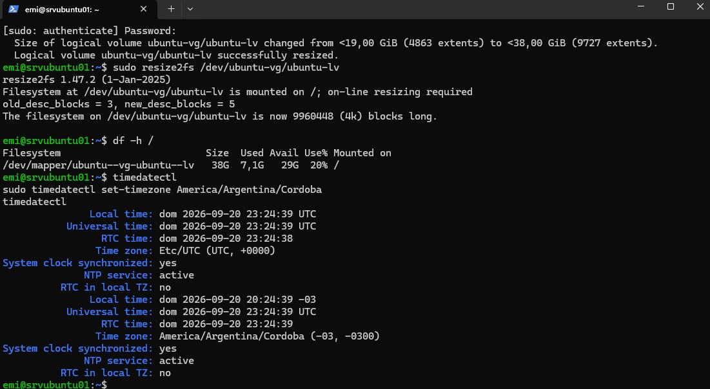

*timedatectl antes y después de configurar la zona horaria.*

#### Paso 10 - Nombre del equipo

Durante la instalación el equipo quedó nombrado srvubuntu01. Se lo
renombra a **srv-ubuntu01** con hostnamectl, siguiendo el mismo criterio
de nombres del servidor Windows del TP1. El cambio se aplica de
inmediato y se hace visible en el prompt al volver a iniciar sesión.

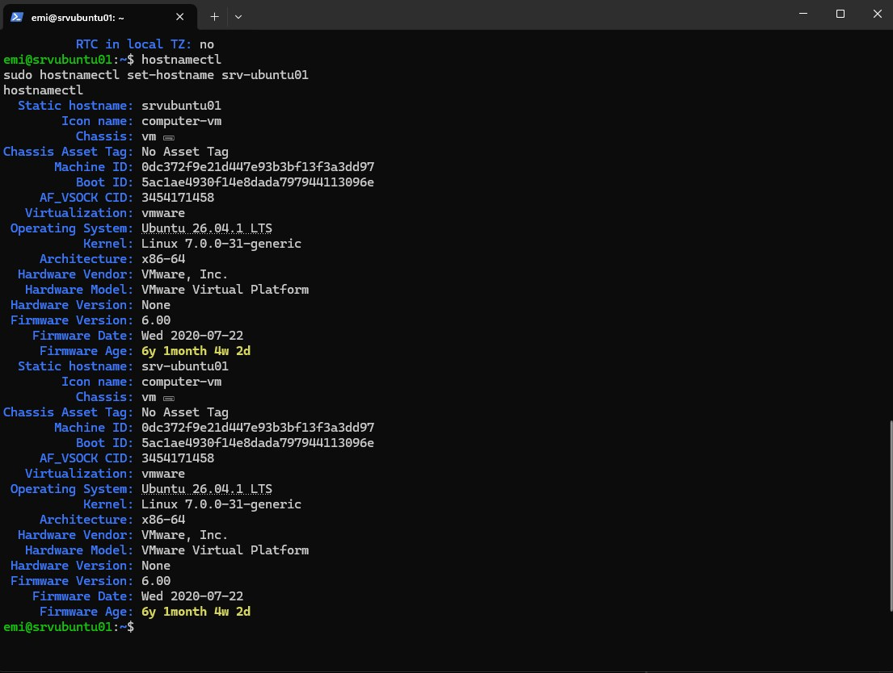

*hostnamectl antes (srvubuntu01) y después (srv-ubuntu01) del cambio.*

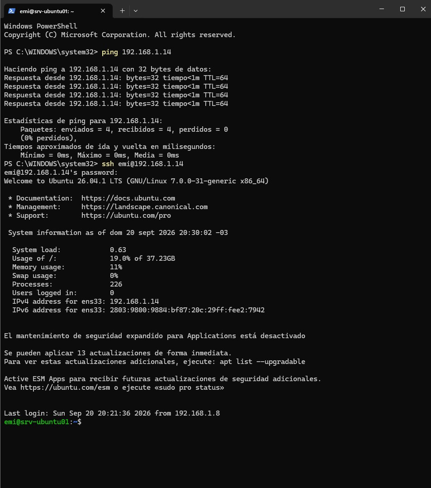

*Nueva conexión SSH: el prompt ya muestra emi@srv-ubuntu01 y el uso de /
es de 37,23 GB.*

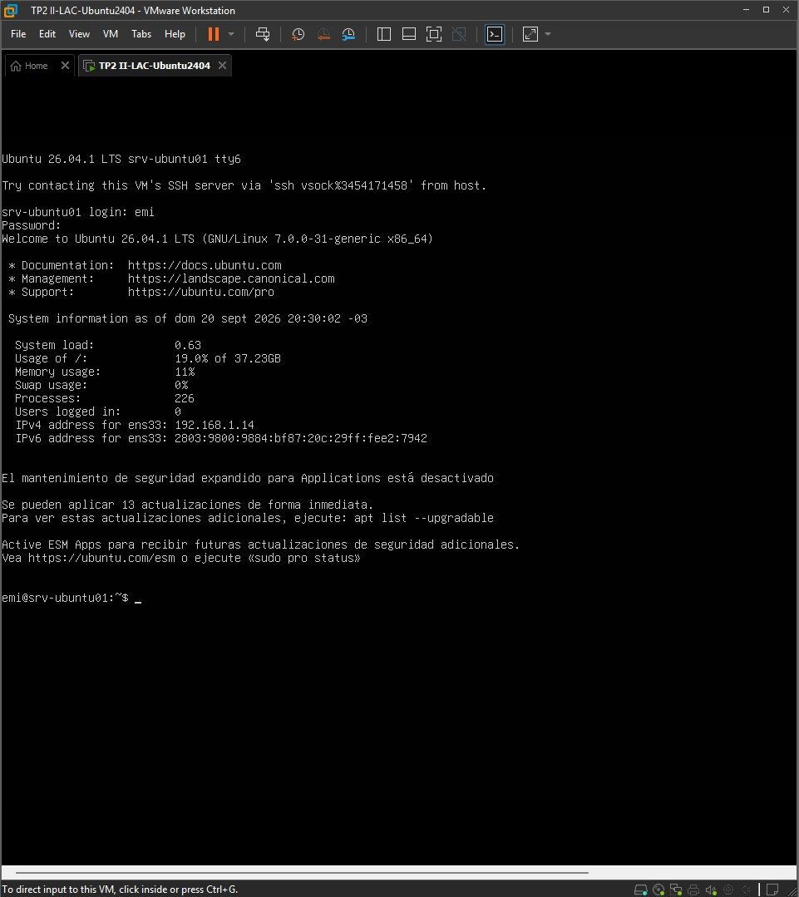

*Consola de la VM con el nuevo nombre del equipo (srv-ubuntu01) tras
reiniciar.*

#### Paso 11 - Verificación de red y comunicación con otras máquinas

Se verifica la configuración de red y la conectividad en ambos sentidos.
Con ip a se ve la interfaz ens33 activa con IP 192.168.1.14/24 asignada
por DHCP. Desde la VM se hace ping a 8.8.8.8 (Internet por IP) y a
google.com (resolución DNS); desde la PC anfitrión se hace ping a la VM.
Todas las pruebas por IPv4 se realizaron sin pérdida de paquetes.

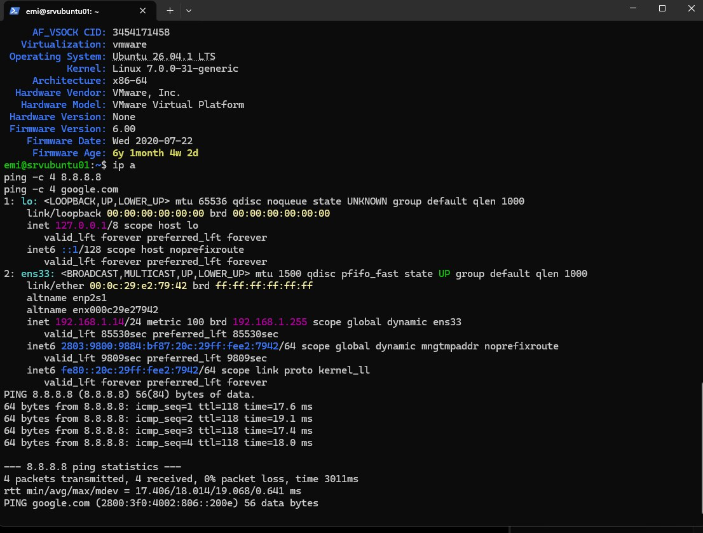

*ip a (ens33 = 192.168.1.14/24) y ping a 8.8.8.8: 4 enviados, 4
recibidos, 0% de pérdida.*

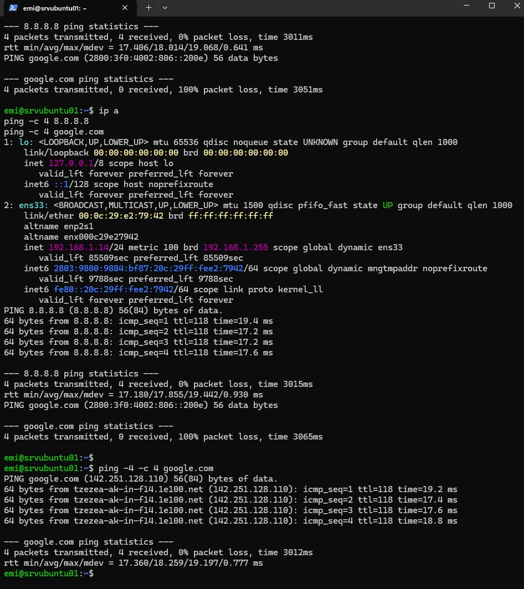

*ping -4 a google.com: resuelve el nombre (142.251.128.110) y responde
sin pérdidas.*

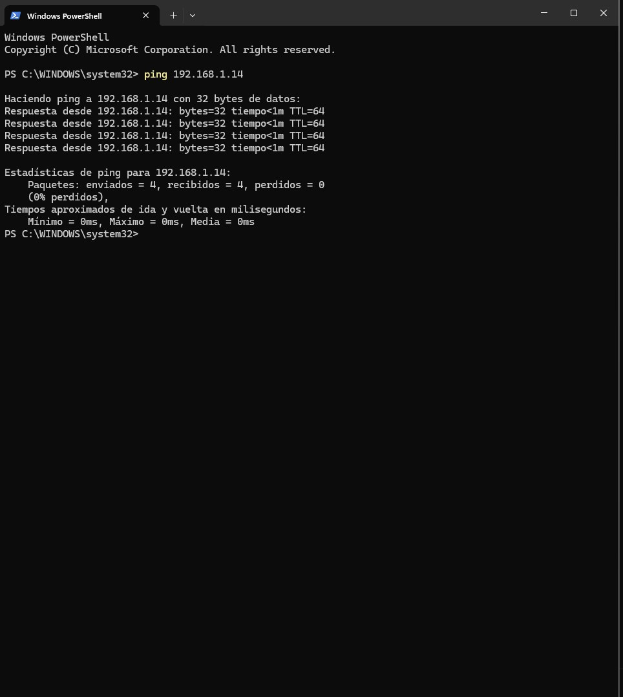

*Ping desde la PC anfitrión a la VM (192.168.1.14): 0% de pérdida.*

#### Paso 12 - Ubicación definitiva de la máquina virtual

Una vez finalizada la instalación se apagó ordenadamente el servidor
(sudo poweroff) y los archivos de la VM se movieron a la carpeta
específica del trabajo (06-TP2\00-VM), separada de las capturas y del
informe (06-TP2\01-Entregables). La máquina se volvió a abrir desde su
nueva ubicación (File \> Open, "I moved it") y arrancó correctamente
(ver Problema 1).

### 3. Problemas encontrados y cómo se resolvieron

#### Problema 1 - Archivos de la VM en una carpeta no deseada

El asistente de VMware propone por defecto guardar la máquina en
Documentos\Virtual Machines, que en este equipo está sincronizada con
OneDrive. Ya en el TP1 los archivos de la VM habían quedado mezclados
con la documentación (decenas de archivos .vmdk y .lck sincronizándose).
**Solución:** para este trabajo se definió una carpeta propia 00-VM,
separada de los entregables; se apagó la VM, se pausó la sincronización
de OneDrive, se movió la carpeta completa (todos los archivos juntos,
porque los discos dependen entre sí) y se la abrió desde el nuevo lugar
indicando que fue movida. Como recomendación, conviene pausar OneDrive
mientras la VM está encendida para evitar bloqueos y consumo de cuota.

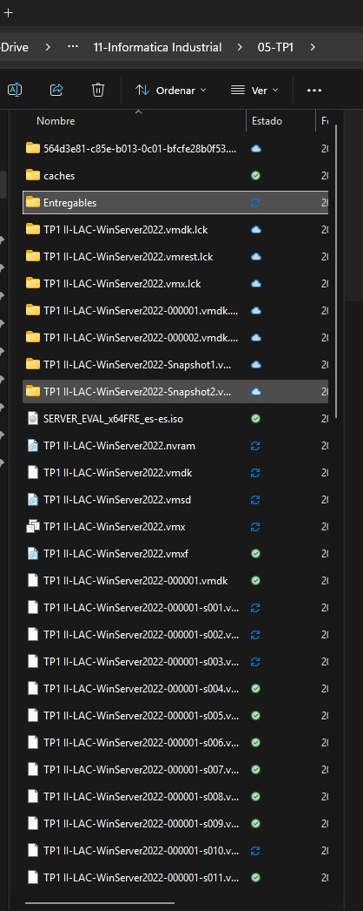

*Archivos de máquinas virtuales mezclados con la documentación en
OneDrive.*

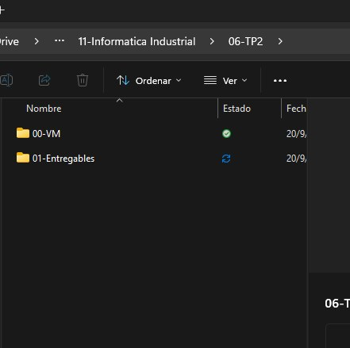

*Estructura definitiva del TP2: 00-VM (máquina virtual) y
01-Entregables.*

#### Problema 2 - Distribución de teclado incorrecta en la consola

En la consola de la VM, los comandos escritos con caracteres especiales
salieron alterados (la barra / aparecía como -, el signo + como ¿ y el
guion como una comilla), porque la distribución de teclado del
instalador no coincidía con la del teclado físico. Los comandos no se
ejecutaron y la consola quedó esperando por una comilla sin cerrar.
**Solución:** cancelar con Ctrl+C y continuar la administración por SSH
desde PowerShell, donde se usa el teclado de Windows sin inconvenientes.
Como corrección definitiva se recomienda reconfigurar el teclado del
servidor con sudo dpkg-reconfigure keyboard-configuration.

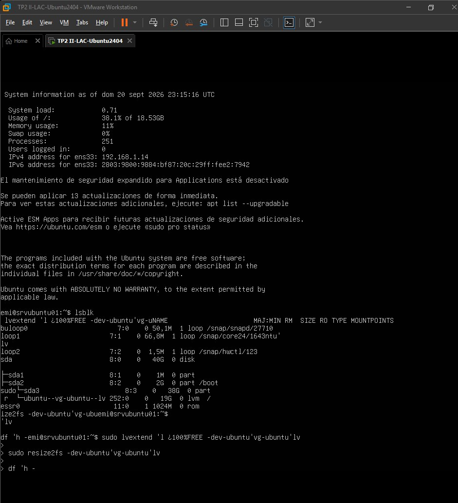

*Comandos alterados por la distribución de teclado (lvextend y resize2fs
mal escritos).*

#### Problema 3 - ping a google.com sin respuesta

El primer ping google.com mostró 100% de paquetes perdidos, mientras que
ping 8.8.8.8 funcionaba. El nombre se había resuelto a una dirección
IPv6 (2800:3f0:...) y la red local no enruta tráfico IPv6 hacia
Internet. **Solución/verificación:** forzar IPv4 con ping -4 -c 4
google.com, que respondió sin pérdidas; esto confirma que el DNS y la
salida a Internet por IPv4 funcionan correctamente y que la falla era
solo de la ruta IPv6 de la red doméstica.

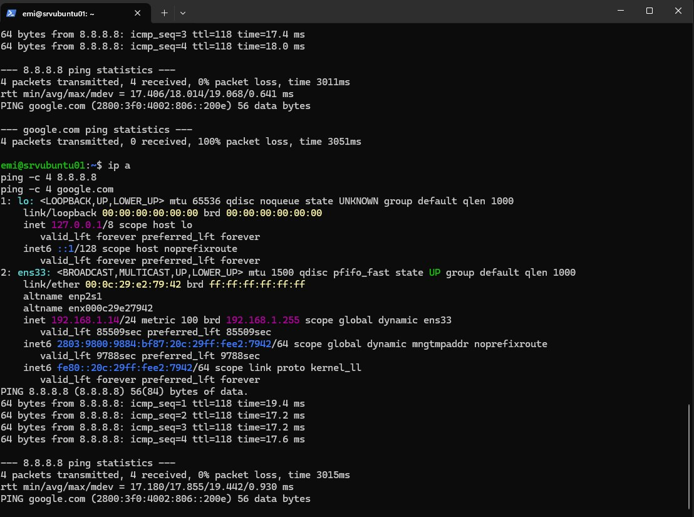

*ping google.com por IPv6: 100% de pérdida (mientras 8.8.8.8 por IPv4
funciona).*

*La máquina virtual del TP1 y la del TP2 quedan disponibles, con sus
snapshots (Windows Server) y en su carpeta de trabajo (Ubuntu Server),
para su revisión.*

# 3. Bloque 2 — Migración a la nube y ciberseguridad

## 3.1 Creación de la cuenta de AWS

El acceso a AWS se realizó con los siguientes pasos: registro con
dirección de correo, nombre de cuenta y contraseña; selección del plan
de cuenta (**Free plan**, para cuentas nuevas); carga de datos de
contacto y de una tarjeta de pago para la verificación; verificación por
correo electrónico y por teléfono; e ingreso a la consola como usuario
raíz. Se trabajó en la región **us-east-1 (Norte de Virginia)**, que es
donde se creó posteriormente la base de datos. Por buena práctica de
seguridad, correspondería además activar la autenticación multifactor
(MFA) sobre la cuenta raíz.

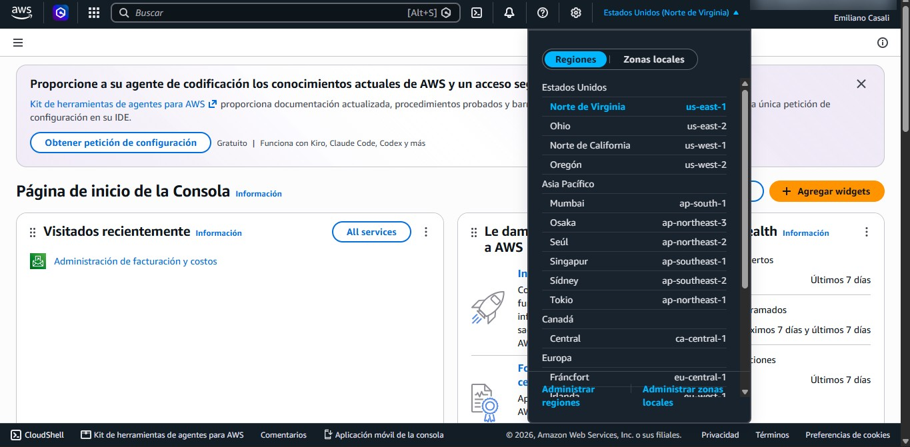

*Página de inicio de la consola de AWS, con la región de trabajo (Norte
de Virginia) seleccionada.*

*El identificador numérico de la cuenta de AWS no se incluye en este
informe ni en las capturas por tratarse de un dato sensible.*

## 3.2 Responsabilidad compartida y Security Group

En la nube rige el modelo de **responsabilidad compartida**: AWS se
ocupa de la seguridad *de* la nube (centros de datos, hardware, red
física, virtualización y parches del motor de base de datos), mientras
que el usuario se ocupa de la seguridad *en* la nube: quién se
conecta, las contraseñas, las reglas del Security Group y los datos. El
Security Group de la instancia RDS es, entonces, responsabilidad del
grupo.

Un Security Group es un firewall virtual con estado. Se creó una regla
de entrada de tipo **MSSQL**, protocolo **TCP**, puerto **1433** (el
puerto por defecto de SQL Server), con origen **Mi IP**. La consola
completa automáticamente ese origen con la dirección IP pública del
equipo y la máscara /32, es decir, una única dirección autorizada.

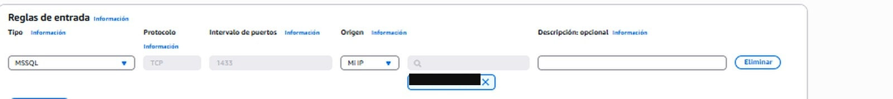

*Regla de entrada del Security Group: MSSQL, TCP, puerto 1433, origen Mi
IP /32 (dirección tapada por tratarse de la IP pública del equipo).*

**Por qué restringir a Mi IP en lugar de 0.0.0.0/0:** por el principio
de mínimo privilegio. Con la regla limitada a una sola dirección, solo
el equipo del grupo puede intentar conectarse y la superficie de ataque
es mínima. Si el origen se hubiera dejado en **0.0.0.0/0**, la base
habría quedado publicada a todo Internet, donde existen escáneres que
recorren continuamente el puerto 1433: intentos de fuerza bruta contra
el usuario administrador, explotación de vulnerabilidades del motor,
robo o cifrado de datos mediante ransomware, y consumo de recursos con
el consiguiente costo. En un entorno industrial real la base de datos no
se expone directamente a Internet: se ubica en una subred privada, con
acceso por VPN y usuarios con permisos mínimos; en el laboratorio se
utilizó acceso público únicamente por necesidad práctica.

# 4. Bloque 3 — Implementación en Amazon RDS

## 4.1 Creación de la instancia SQL Server Express

Para la base de datos se utilizó **Amazon RDS**, un servicio de base de
datos administrada: AWS se encarga del sistema operativo subyacente, de
los parches y de los respaldos automáticos. La instancia se configuró
con el motor **Microsoft SQL Server, edición Express** (la edición
gratuita, con un límite de 10 GiB por base), método de creación
**Standard create**, disponibilidad **Single-AZ** (no se necesita alta
disponibilidad en un entorno de laboratorio), identificador
**planta-industrial-db**, usuario maestro **admin**, **20 GiB** de
almacenamiento en SSD, puerto **1433** y acceso público, filtrado por el
Security Group descripto en la sección anterior.

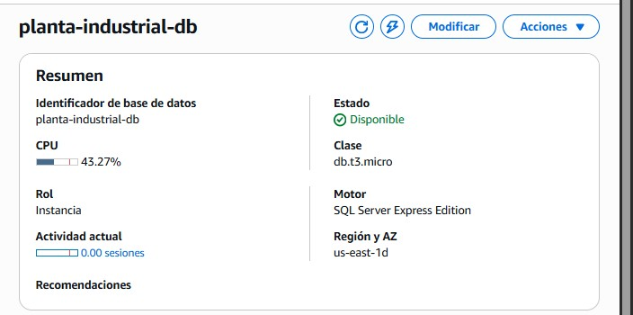

*Resumen de la instancia planta-industrial-db: estado Disponible, motor
SQL Server Express Edition, clase db.t3.micro, región/AZ us-east-1d.*

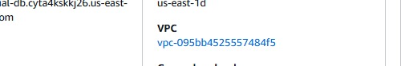

*Datos de conectividad de la instancia: endpoint (parcialmente visible)
y VPC asociada.*

## 4.2 Conexión desde SQL Server Management Studio

La conexión se estableció desde SSMS instalado en la PC del grupo,
utilizando como nombre de servidor el endpoint de la instancia seguido
de una coma y el número de puerto (**endpoint,1433**; es una coma, no
dos puntos), con autenticación de SQL Server y el usuario maestro
**admin**. Antes de la demostración en vivo conviene verificar que la
regla "Mi IP" del Security Group siga apuntando a la IP pública actual
del equipo, ya que esta puede cambiar entre sesiones.

| **Campo**           | **Valor**                     |
|---------------------|-------------------------------|
| Tipo de servidor    | Database Engine               |
| Nombre del servidor | endpoint-de-la-instancia,1433 |
| Autenticación       | SQL Server Authentication     |
| Inicio de sesión    | admin                         |

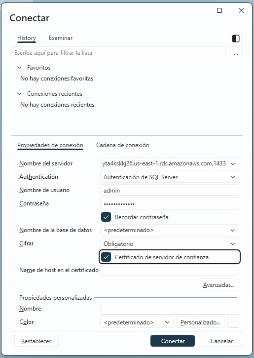

*Cuadro de conexión de SSMS a la instancia de RDS.*

## 4.3 Script Transact-SQL completo

El script se ejecutó en SSMS ya conectado a la instancia y consta de
tres partes: creación de la base de datos y de la tabla de monitoreo
(DDL), carga de datos de prueba (DML) y consultas de verificación.

### Parte 1 — Creación de la base de datos y de la tabla

```sql
CREATE DATABASE Planta_Industrial;

GO

USE Planta_Industrial;

GO


CREATE TABLE dbo.Eventos_Planta (

id_evento INT IDENTITY(1,1) PRIMARY KEY,

fecha_hora DATETIME2(0) NOT NULL

DEFAULT SYSDATETIME(),

equipo VARCHAR(50) NOT NULL,

tipo_evento VARCHAR(20) NOT NULL

CHECK (tipo_evento IN ('FALLA','ALARMA',

'PRODUCCION','MANTENIMIENTO')),

descripcion VARCHAR(200) NULL,

valor DECIMAL(10,2) NULL,

unidad VARCHAR(10) NULL

);

GO
```

**CREATE DATABASE** y **CREATE TABLE** son sentencias DDL (Data
Definition Language): definen estructuras. **USE** cambia el contexto de
ejecución a la base recién creada. **GO** no es una instrucción de
T-SQL, sino un separador de lotes propio de SSMS. Dentro de la tabla:
**IDENTITY(1,1)** numera automáticamente cada evento; **PRIMARY KEY**
garantiza que cada fila tenga un identificador único; **NOT NULL**
obliga a cargar el dato; **DEFAULT SYSDATETIME()** sella la fecha y hora
del evento sin necesidad de cargarla manualmente; y la restricción
**CHECK** garantiza la integridad de los datos, admitiendo solo los
cuatro tipos de evento definidos. Esta tabla modela el registro de
eventos de una planta industrial (fallas, alarmas, producción y
mantenimiento), con fecha, equipo, valor y unidad, como base de un
histórico que podría alimentar un sistema SCADA o un tablero de
indicadores.

### Parte 2 — Carga de datos de prueba y consultas

```sql
INSERT INTO dbo.Eventos_Planta

(equipo, tipo_evento, descripcion, valor, unidad)

VALUES

('Motor M-101', 'FALLA', 'Sobrecorriente', 18.50, 'A'),

('Bomba B-201', 'ALARMA', 'Presion alta', 7.20, 'bar'),

('Linea 1', 'PRODUCCION', 'Piezas del turno', 1250.00, 'un'),

('Horno H-301', 'ALARMA', 'Temperatura alta', 412.00, 'C');

GO


-- Consulta 1: todas las filas cargadas

SELECT * FROM dbo.Eventos_Planta;


-- Consulta 2: cantidad de eventos por tipo

SELECT tipo_evento, COUNT(*) AS cantidad

FROM dbo.Eventos_Planta

GROUP BY tipo_evento;
```

**INSERT** es una sentencia DML (Data Manipulation Language): agrega
cuatro filas con eventos de ejemplo de una planta industrial (una falla
en un motor, una alarma de presión, un registro de producción y una
alarma de temperatura). La primera consulta **SELECT** muestra todas las
filas cargadas; la segunda agrupa con **GROUP BY** y cuenta cuántos
eventos hay de cada tipo. En síntesis: DDL define estructuras (CREATE,
ALTER, DROP) y DML manipula los datos que esas estructuras contienen
(INSERT, SELECT, UPDATE, DELETE).

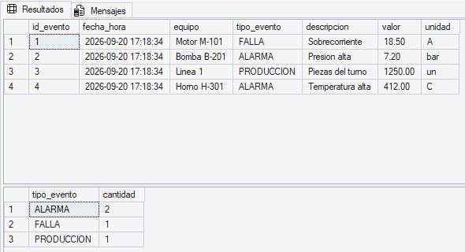

*Resultado real del script en SSMS: las cuatro filas cargadas y el
conteo de eventos por tipo.*

# 5. Conclusiones generales

1.  **Virtualización de laboratorio.** Un mismo equipo físico permitió
    correr, mediante VMware Workstation, tanto un servidor Windows como
    uno Linux, probando configuraciones sin necesidad de hardware
    dedicado y con la posibilidad de volver atrás mediante snapshots.

2.  **Roles distintos, misma exigencia de continuidad.** Windows Server
    con IIS y Ubuntu Server cubren distintos roles típicos de una planta
    industrial, pero ambos se dimensionan pensando en la disponibilidad
    continua de los servicios que sostienen.

3.  **La red Bridged como condición de alcanzabilidad.** En ambos
    trabajos prácticos, el modo Bridged permitió que la máquina virtual
    fuera un equipo más de la red local, alcanzable por otros equipos, a
    diferencia de NAT o Host-only.

4.  **La nube exige seguridad de acceso.** Migrar la base de datos a
    Amazon RDS aportó escalabilidad y respaldo administrado, pero
    desplazó la responsabilidad de la seguridad de acceso hacia el
    usuario: el Security Group, configurado con el principio de mínimo
    privilegio (Mi IP en lugar de 0.0.0.0/0), es la pieza central de esa
    seguridad.

5.  **De la infraestructura a los datos.** El script Transact-SQL cierra
    el recorrido: una base de eventos de planta (Planta_Industrial)
    queda lista para alimentar, en un caso real, un histórico industrial
    o un tablero de indicadores.
